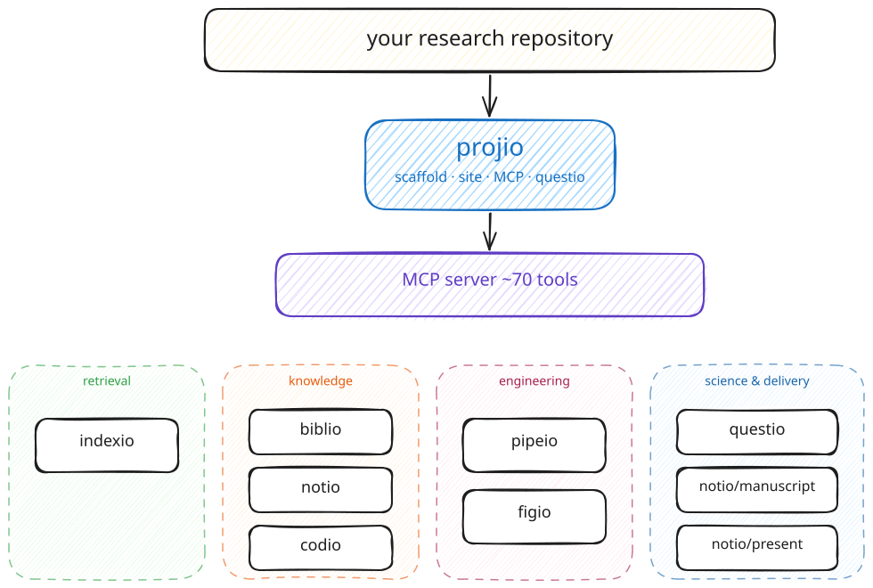
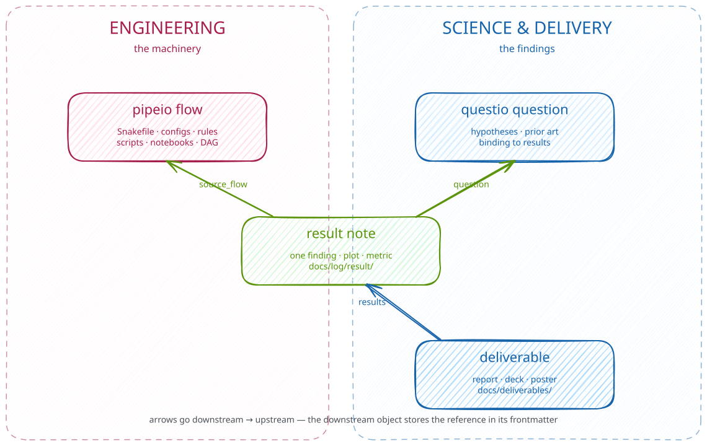

## what projio is

A research repository becomes **queryable knowledge** for humans and AI
agents — through one MCP surface that ties code, papers, notes,
pipelines, figures, and questions together.

::: {.fragment .smaller}
The repo stays the primary unit of knowledge. Projio doesn't ask you to
move your work somewhere else; it makes your work legible from the
place where it already lives.
:::

::: {.notes}
30-second framing. The pitch is "your repo, made queryable" — not
"another tool to learn." Don't dwell.
:::

---

## the shape

{fig-align="center" width="80%"}

::: {.fragment .smaller}
~70 MCP tools, six focused subpackages, one entry point.
:::

::: {.notes}
60s on the diagram. Walk the audience left to right:
- repo at the top (their thing)
- projio in the middle (small — scaffold + site + MCP + questio)
- MCP server (the agent-facing surface)
- four layers of subpackages (retrieval / knowledge / engineering / science)

Don't read the box names — let the diagram do that work.
:::

---

## which subpackage do I need?

| I want to... | Use |
|---|---|
| Find code, notes, or papers by semantic search | **indexio** |
| Manage bibliography, fetch PDFs, resolve citekeys | **biblio** |
| Capture an idea, decision, or meeting note | **notio** |
| Discover reusable code, register a new library | **codio** |
| Author a data-processing pipeline or notebook | **pipeio** |
| Build a figure from a declarative spec | **figio** |
| Track a research question, bind it to results | **questio** |
| Assemble a manuscript or build a slide deck | **notio/manuscript · notio/present** |

::: {.notes}
75s. This is the screenshot slide — audience members will photograph
this. Don't read every row; pick 2-3 that are most relevant to the
audience and gesture at the rest.
:::

---

## what it does for you

{fig-align="center" width="75%"}

::: {.fragment .smaller}
**Engineering** (pipeio) owns the machinery. **Science** (questio,
result notes, deliverables) owns the findings. Every plot in your
manuscript traces back to a flow. Every claim traces back to a
question.
:::

::: {.notes}
75s. The delegation model is the *value prop* — projio enforces the
boundary so future-you / collaborators / AI agents can pick up the
project cold. Examples:
- a result note has source_flow → which pipeio rule made the data
- a deliverable lists results: → which findings it summarises
- a flow doesn't embed result plots — it owns the data, not the story

Pixecog reference if asked: preprocess_ieeg is engineering; H1-H7 in
plan/questions.yml are science; coupling_spindle_ripple bridges them.
:::

---

## adopt it

```bash
pip install "projio[all]"            # core + all 6 subpackages
projio init --kind study             # scaffold .projio/, .mcp.json, .claude/
projio sync                          # auto-discover code, sync filters
```

Open the repo in Claude Code. The MCP tools are pre-permissioned —
`rag_query`, `pipeio_run`, `biblio_ingest`, etc. all available without
further setup.

::: {.fragment .smaller}
Docs: <https://arashshahidi1997.github.io/projio/> · Source:
<https://github.com/arashshahidi1997/projio>
:::

::: {.notes}
45s. End on the install recipe so anyone curious can try it
immediately. The MCP-pre-permissioned bit is what makes this not just
"another Python package" — it's an agent-aware setup.

Stop the talk here. Audience can ask about specifics; the slides have
done their job.
:::
