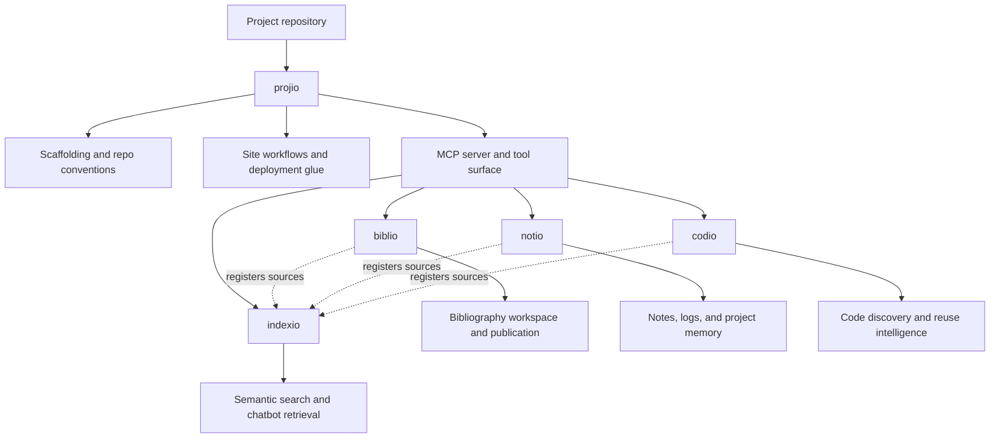

# Ecosystem

`projio` is the workspace and orchestration layer for a small documentation and knowledge-tool ecosystem.

The split is deliberate:

- `projio` owns project-local scaffolding, docs-site workflows, and MCP exposure
- `indexio` owns semantic search and chat-backed retrieval
- `biblio` owns bibliography ingestion, enrichment, and bibliography-first sites
- `notio` owns notes and structured project logs
- `codio` owns code-library and code-context discovery

## Role diagram

`projio` is the coordinator. The sibling packages stay focused on their own domain, and `indexio` acts as shared retrieval infrastructure where cross-package search is needed.

## GitHub Pages placeholders

- `projio`: <https://arashshahidi1997.github.io/projio/>
- `indexio`: <https://arashshahidi1997.github.io/indexio/>
- `biblio`: <https://arashshahidi1997.github.io/biblio/>
- `notio`: <https://arashshahidi1997.github.io/notio/>
- `codio`: <https://arashshahidi1997.github.io/codio/>

## Mental model

Use `projio` when you need a repo-wide entrypoint that ties those tools together. Use the tool-specific docs when you are working inside one subsystem in depth.
