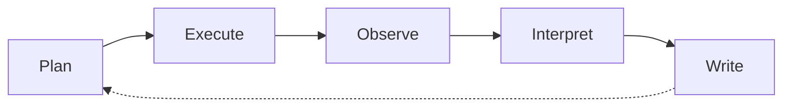
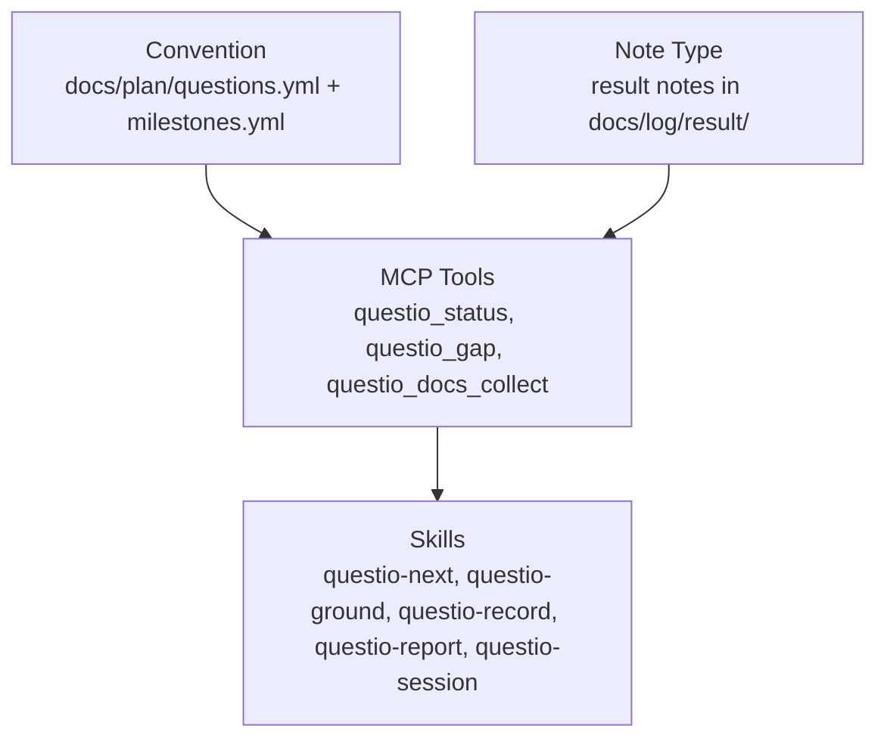
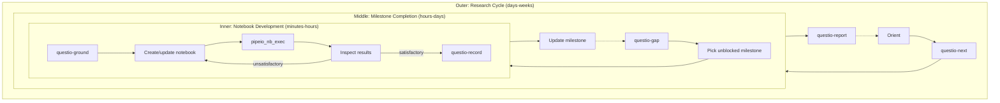

# Questio: Research Orchestration

Questio is a research orchestration layer that connects projio's subsystems around the scientific reasoning cycle: question, evidence, answer, manuscript.

## The gap questio fills

Projio's subsystems cover pipeline execution (pipeio), literature (biblio), notes (notio), code intelligence (codio), search (indexio), and manuscript assembly (manuscripto). But no subsystem understands **why** work is being done. An agent can run a pipeline and capture a note, but cannot answer:

- "What pipeline runs are needed to test hypothesis H3?"
- "Is there enough evidence to draft the Results section?"
- "What is the highest-impact unblocked work right now?"

Questio provides this reasoning layer.

## Research workflow ontology

Research follows a cyclic workflow. Each phase maps to a projio subsystem:



| Phase | Subsystem | Questio role |
|-------|-----------|-------------|
| **Plan** | questio | Track questions, milestones, dependencies |
| **Execute** | pipeio | Questio recommends which pipelines to run |
| **Observe** | notio | Questio captures structured result notes |
| **Interpret** | biblio + notio | Questio checks evidence against literature |
| **Write** | manuscripto | Questio reports which sections are draftable |

## Architecture

Questio is not a separate package. It's implemented as three lightweight layers:



| Layer | What | Where |
|-------|------|-------|
| **Convention** | YAML schemas for questions and milestones | `docs/plan/questions.yml`, `docs/plan/milestones.yml` |
| **Note type** | Dedicated `result` note type with structured frontmatter | `docs/log/result/` |
| **MCP tools** | Structured queries: status overview, gap analysis, docs generation | `src/projio/mcp/questio.py` |
| **Skills** | Prompt-based workflows composing existing tools | `.projio/skills/questio-*.md` |

## Data model

### Research questions

Questions are the top-level entity. A hypothesis is a specific type of question.

```yaml
# docs/plan/questions.yml
questions:
  H1:
    text: "Do cortical delta waves precede ripple initiation?"
    type: hypothesis        # hypothesis | exploratory | descriptive
    prediction: "Large, spatially coherent cortical delta waves precede ripple initiation"
    pipelines: [spectrogram_burst, sharpwaveripple, coupling_spindle_ripple]
    milestones: [swr-detection-validated, delta-event-detection, delta-ripple-coupling]
    manuscript_section: results/h1-delta-ripple
    status: not_started     # not_started | in_progress | blocked | sufficient | confirmed | refuted
    depends_on: []
    citations: ["@sirota_2003", "@isomura_2006"]
```

### Milestones

Milestones are decoupled from questions — multiple questions can share a milestone. They form a dependency graph.

```yaml
# docs/plan/milestones.yml
milestones:
  swr-detection-validated:
    description: "SWR detection validated across all subjects"
    pipelines: [sharpwaveripple]
    depends_on: [preprocessing-stable]
    status: not_started
    evidence: []            # list of result note IDs
```

### Evidence (result notes)

Evidence is captured as notio notes with a dedicated `result` type:

```yaml
# docs/log/result/result-arash-20260415-143022-123456.md
---
title: "SWR detection rate across subjects"
tags: [result]
series: sharpwaveripple
question: [H1, H3]
milestone: swr-detection-validated
metric: detection_rate_per_minute
value: "12.3 +/- 2.1"
confidence: validated       # preliminary | validated | final
---
```

The `question` and `milestone` frontmatter fields are the semantic links that make evidence queryable.

## MCP tools

Three tools provide the structured query interface:

| Tool | Purpose |
|------|---------|
| `questio_status` | Overview of research state: questions, milestone completion %, evidence counts, blockers |
| `questio_gap` | Per-question gap analysis: unmet milestones, blocked vs actionable items, recommendation |
| `questio_docs_collect` | Generate `docs/plan/` pages (questions table, milestones tracker, mermaid roadmap, evidence index) |

## Skills

Skills compose MCP tools into research workflows:

| Skill | When to use |
|-------|-------------|
| `questio-session` | Full research session: orient, plan, ground, execute, record, report |
| `questio-next` | "What should I work on?" — dependency-aware prioritization |
| `questio-ground` | Before starting work: gather literature context, find code, check prior attempts |
| `questio-record` | After producing results: create structured evidence note, update milestone |
| `questio-report` | Progress summary for supervisor: milestones hit, key results, blockers |

## Workflow loops

Research operates as nested loops at different timescales:



| Loop | Automation | Agent autonomy |
|------|-----------|---------------|
| Inner (notebook) | Fully automatable | High — iterate until quality criteria met |
| Middle (milestone) | Semi-automated | Medium — pause at checkpoints |
| Outer (research cycle) | Agent-guided | Low — human approves direction |

## Docs site rendering

`questio_docs_collect` generates five auto-generated pages in `docs/plan/`:

| Page | Content |
|------|---------|
| `index.md` | Overall progress summary with links |
| `questions.md` | Question registry table with status and evidence counts |
| `milestones.md` | Milestone tracker grouped by question with evidence links |
| `roadmap.md` | Mermaid dependency diagram with status-colored nodes |
| `evidence.md` | Per-question evidence dossier with linked result notes |

These are output artifacts (like `compiled.bib`) — regenerated from YAML, not hand-edited.

## Relationship to worklog

Questio is **project-local** research reasoning. Worklog is **cross-project** coordination. The boundary is strict:

| Concern | Questio | Worklog |
|---------|---------|---------|
| "What should I investigate?" | `questio-next` | -- |
| "Which project should I work on?" | -- | `focus()` |
| "How is H3 progressing?" | `questio_status("H3")` | -- |
| "How is pixecog overall?" | -- | `get_project("pixecog")` |

Worklog may optionally read `docs/plan/questions.yml` and `docs/plan/milestones.yml` to derive goal progress. Data flows project to worklog, never the reverse.

## Design spec

The full design spec with all open questions is at [docs/specs/research-orchestration/design.md](../specs/research-orchestration/design.md).
