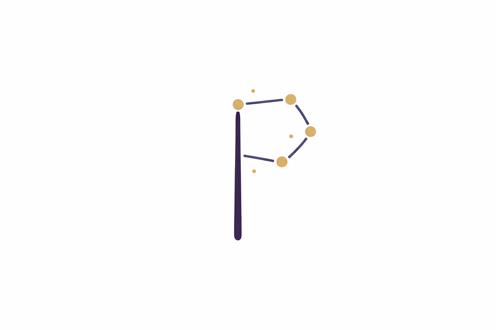
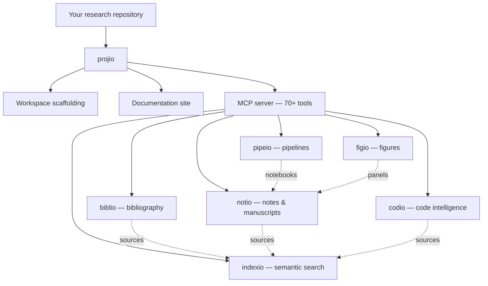

<p align="center">
  
</p>

# projio

**Project knowledge orchestrator and MCP server for research repositories.**

Projio turns a research repository into a queryable knowledge environment for humans and AI agents. It provides structured, machine-accessible knowledge layers over a repository by integrating code, papers, notes, pipelines, figures, and documentation through a unified [MCP server](reference/mcp-tools.md) interface.

## Install

```bash
pip install projio                # core orchestrator + MCP server
pip install "projio[all]"         # all ecosystem packages
```

## Architecture



## Ecosystem

| Package | Domain | What it does |
|---------|--------|-------------|
| **projio** | orchestration | Workspace scaffold, site workflows, MCP entrypoint |
| **[indexio](https://arashshahidi1997.github.io/indexio/)** | retrieval | Corpus indexing, chunking, embedding, semantic search |
| **[biblio](https://arashshahidi1997.github.io/biblio/)** | literature | Bibliography management, citekey resolution, paper context |
| **[notio](https://arashshahidi1997.github.io/notio/)** | notes | Structured notes, idea capture, manuscript assembly & rendering |
| **[codio](https://arashshahidi1997.github.io/codio/)** | code | Library registry, code reuse discovery, implementation strategy |
| **[pipeio](https://arashshahidi1997.github.io/pipeio/)** | pipelines | Pipeline authoring, contracts, notebook lifecycle, Snakemake integration |
| **[figio](https://arashshahidi1997.github.io/figio/)** | figures | Declarative figure specs, panel rendering, SVG/PDF composition |

## Key capabilities

- **Search before creation** — discover existing implementations, consult literature, then decide: reuse, wrap, or implement new
- **70+ MCP tools** — unified agent interface across all subsystems, scoped to the current project
- **Three workspace kinds** — `generic`, `tool`, and `study` scaffolds for different project types
- **Bibliography pipeline** — Zotero sync, OpenAlex enrichment, PDF fetch, GROBID/Docling parsing, compiled BibTeX
- **Manuscript production** — section assembly, citation checking, figure insertion, pandoc rendering to PDF/LaTeX
- **Pipeline management** — Snakemake flows, notebook lifecycle, DAG export, cross-flow orchestration
- **Documentation site** — MkDocs Material with semantic search chatbot integration

## Documentation

The docs follow the [Diataxis](https://diataxis.fr/) structure:

| Section | Purpose | Start here |
|---------|---------|-----------|
| [Tutorials](tutorials/index.md) | End-to-end guided paths | [Quickstart](tutorials/quickstart.md) |
| [How-to guides](how-to/index.md) | Task-focused recipes | [Initialize a workspace](how-to/init.md) |
| [Explanation](explanation/index.md) | Design choices and concepts | [Ecosystem](explanation/ecosystem.md) |
| [Reference](reference/index.md) | Command and layout details | [CLI](reference/cli.md), [MCP tools](reference/mcp-tools.md) |
