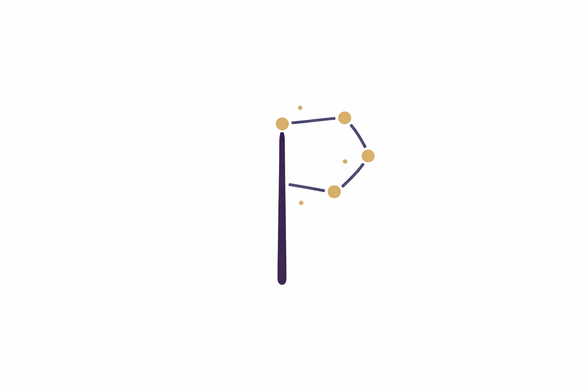
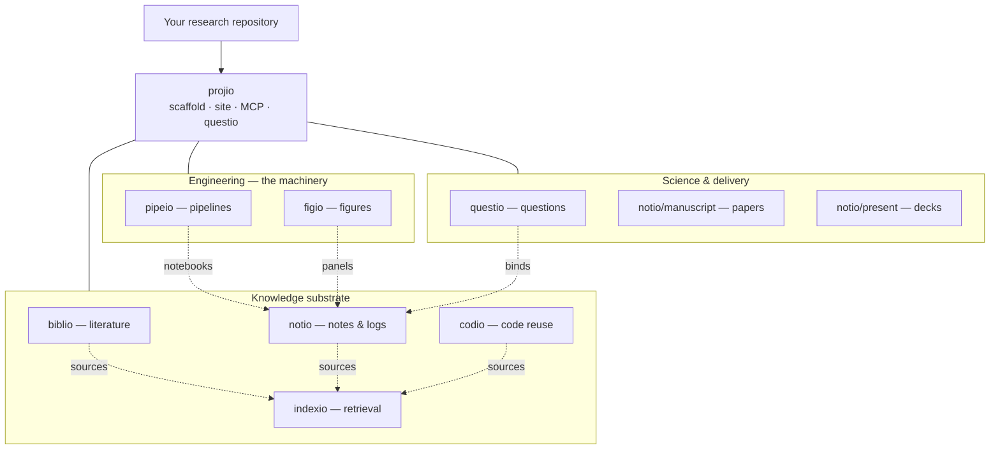

<p align="center">
  
</p>

# projio

**Project knowledge orchestrator and MCP server for research repositories.**

Projio turns a research repository into a queryable knowledge environment for humans and AI agents. It layers structured, machine-accessible knowledge over a repo — code, papers, notes, pipelines, figures, questions — and exposes it through a unified [MCP server](reference/mcp-tools.md) so humans and AI agents work from the same view.

## Install

```bash
pip install projio                # core orchestrator + MCP server
pip install "projio[all]"         # all ecosystem packages
```

## What projio owns vs. what it coordinates

Projio itself is small: workspace scaffolding, docs-site workflows, the MCP entrypoint, and the **questio** research-question layer. Everything else lives in focused sibling packages that projio composes. This separation keeps each domain independently usable and specced.


```mermaid
flowchart TD
    R[Your research repository] --> P[projio<br/>scaffold · site · MCP · questio]

    subgraph knowledge [Knowledge substrate]
        biblio[biblio — literature]
        notio[notio — notes & logs]
        codio[codio — code reuse]
        indexio[indexio — retrieval]
    end

    subgraph engineering [Engineering — the machinery]
        pipeio[pipeio — pipelines]
        figio[figio — figures]
    end

    subgraph science [Science & delivery]
        questio[questio — questions]
        manuscripto[notio/manuscript — papers]
        presentio[notio/present — decks]
    end

    P --- knowledge
    P --- engineering
    P --- science

    biblio -. sources .-> indexio
    notio -. sources .-> indexio
    codio -. sources .-> indexio
    pipeio -. notebooks .-> notio
    figio -. panels .-> notio
    questio -. binds .-> notio
```

The **engineering vs. science** split is deliberate — see the [delegation model](explanation/delegation-model.md) for how pipeio flows, result notes, questio questions, and deliverables each own distinct content and link in one direction.

## Ecosystem

### Retrieval substrate

| Package | Goal | Spec |
|---------|------|------|
| **[indexio](https://arashshahidi1997.github.io/indexio/)** | Domain-agnostic corpus indexing, chunking, embedding, and semantic search — the shared retrieval infrastructure every other package registers sources with | [site](https://arashshahidi1997.github.io/indexio/) |

### Knowledge layer

| Package | Goal | Spec |
|---------|------|------|
| **[biblio](https://arashshahidi1997.github.io/biblio/)** | Project-centric bibliography: Zotero sync, OpenAlex/Crossref enrichment, PDF fetch, GROBID/Docling parsing, compiled BibTeX | [bib architecture](specs/biblio/bib-architecture.md) |
| **[notio](https://arashshahidi1997.github.io/notio/)** | Structured project notes, idea capture, worklog — hosts the `manuscript` and `present` subpackages for paper and deck production | [site](https://arashshahidi1997.github.io/notio/) |
| **[codio](https://arashshahidi1997.github.io/codio/)** | Code-library registry with three tiers (core / shared / external), reuse discovery, implementation-strategy intelligence | [code tiers](specs/pipeio/code-tiers.md) |

### Engineering layer

| Package | Goal | Spec |
|---------|------|------|
| **[pipeio](https://arashshahidi1997.github.io/pipeio/)** | Agent-facing pipeline authoring — flows, contracts, notebook lifecycle, Snakemake integration. Owns **engineering, not science** | [pipeio spec](specs/pipeio/index.md) |
| **[figio](https://arashshahidi1997.github.io/figio/)** | Declarative figure orchestration: FigureSpec YAML → panel rendering → SVG composition → PDF/PNG | [site](https://arashshahidi1997.github.io/figio/) |

### Science & delivery

| Subsystem | Goal | Spec |
|-----------|------|------|
| **questio** (in projio core) | Research questions, hypothesis tracking, prior art, binding of questions to results and deliverables | [questio](explanation/questio.md) |
| **notio/manuscript** | Section assembly, citation checking, figure insertion, pandoc → PDF/LaTeX | [site](https://arashshahidi1997.github.io/notio/) |
| **notio/present** | Slide decks from reusable sections — reveal.js and Marp backends, cross-project section import | [presentio](explanation/presentio.md) |
| **deliverables** | Narrative artifacts for external audiences: reports, decks, posters — bind questions and results into a story | [deliverables](specs/deliverables.md) |

## Which subpackage do I need?

| I want to... | Use |
|--------------|-----|
| Find existing code, notes, or papers by semantic search | indexio |
| Manage a project's bibliography, fetch PDFs, resolve citekeys | biblio |
| Capture an idea or record a project decision | notio (notes) |
| Discover reusable code or register a new library | codio |
| Author a data-processing pipeline or notebook | pipeio |
| Build a figure from a declarative spec | figio |
| Track a research question and bind results to it | questio |
| Assemble a manuscript for submission | notio/manuscript |
| Build a slide deck or reveal.js talk | notio/present |

## Key capabilities

- **Search before creation** — discover existing implementations, consult literature, then decide: reuse, wrap, or implement new
- **70+ MCP tools** — unified agent interface across all subsystems, scoped to the current project
- **Three workspace kinds** — `generic`, `tool`, and `study` scaffolds for different project types
- **Engineering/science separation** — pipeio builds the machinery; questio, result notes, and deliverables carry the findings and narrative
- **Documentation site** — MkDocs Material with monorepo plugin and semantic-search chatbot integration

## Documentation

The docs follow the [Diataxis](https://diataxis.fr/) structure:

| Section | Purpose | Start here |
|---------|---------|-----------|
| [Tutorials](tutorials/index.md) | End-to-end guided paths | [Quickstart](tutorials/quickstart.md) |
| [How-to guides](how-to/index.md) | Task-focused recipes | [Initialize a workspace](how-to/init.md) |
| [Explanation](explanation/index.md) | Design choices and concepts | [Ecosystem](explanation/ecosystem.md), [Delegation model](explanation/delegation-model.md) |
| [Reference](reference/index.md) | Command and layout details | [CLI](reference/cli.md), [MCP tools](reference/mcp-tools.md) |
