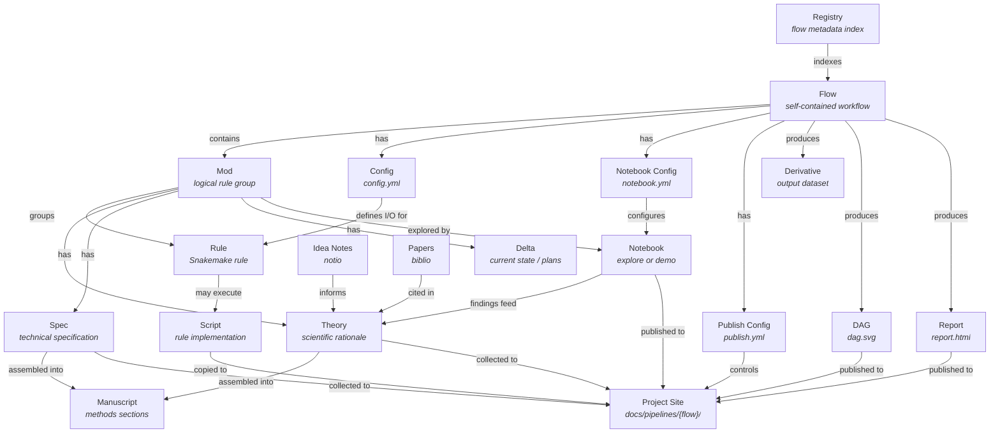
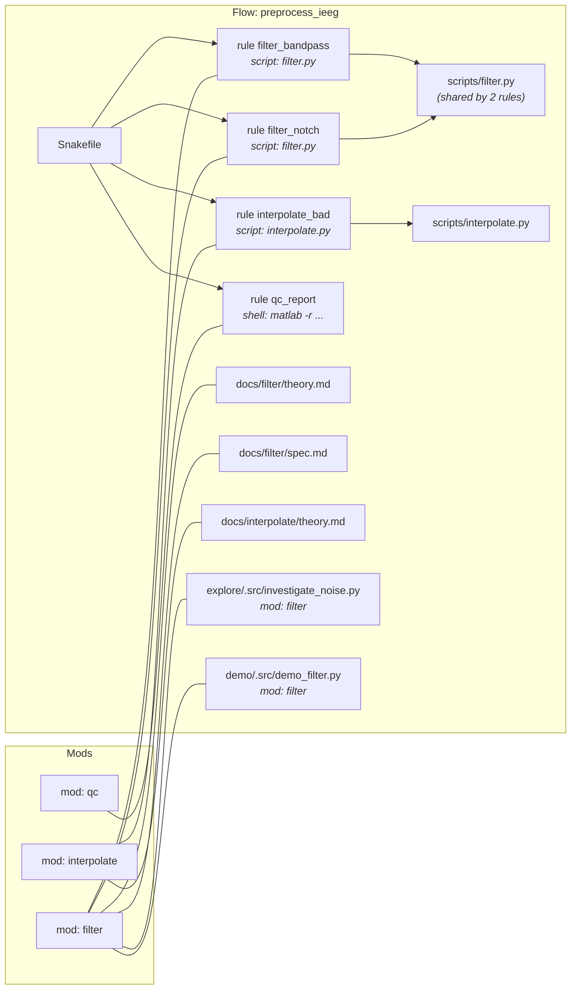
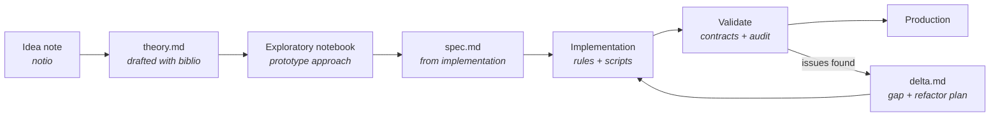
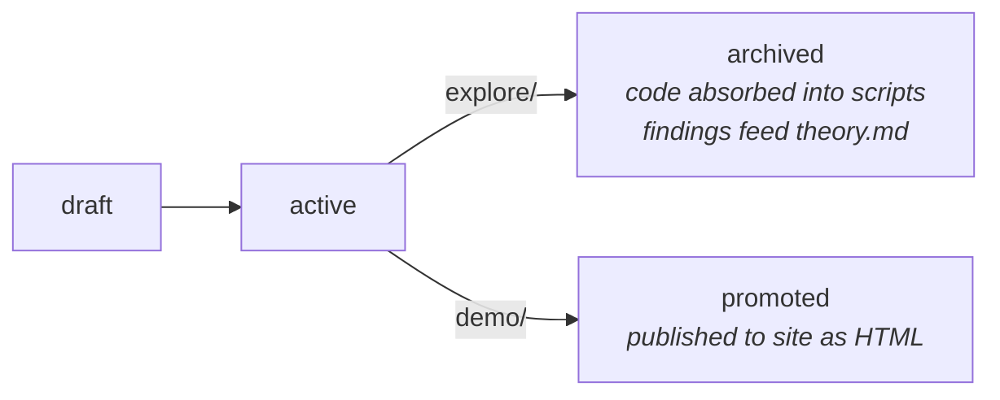
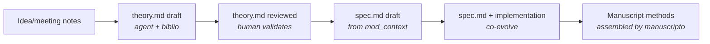

# pipeio: Ontology

## Concepts

pipeio manages a hierarchy of **flows**, **mods**, and their artifacts. Each concept maps to a filesystem convention, a registry entry, and a set of MCP tools.

### Flow

A **flow** is the primary unit of work — a self-contained computational workflow with its own Snakefile, config, notebooks, scripts, and derivative output. Flow names are globally unique.

The flow's **derivative directory** (`derivatives/{flow}/`) is a datalad subdataset containing all pipeline outputs, organized by subject/session.

### Mod

A **mod** (module) is a logical grouping of Snakemake rules within a flow. Mods are identified by rule name prefix: rules named `filter_bandpass`, `filter_notch` belong to mod `filter`. Each mod has:
- One or more rules (in Snakefile or `rules/{mod}.smk`)
- Optionally, scripts shared across rules (`scripts/{script}.py`)
- Documentation in three facets: theory, spec, delta
- Optionally, notebooks investigating or demoing its outputs (one demo per mod is ideal; flow-level demos spanning multiple mods leave `mod` empty)

### Mod Documentation Facets

Each mod has up to three documentation facets, stored in `{flow}/docs/{mod}/`:

| Facet | File | Purpose | Evolves into |
|-------|------|---------|-------------|
| **Theory** | `theory.md` | Scientific rationale, method justification, citations | Manuscript methods: *"We used X because Y [@citekey]"* |
| **Spec** | `spec.md` | Technical specification: I/O contracts, parameters, component manifest | Manuscript methods: *"Implemented as..."*, supplementary materials |
| **Delta** | `delta.md` | Current state, known issues, refactor plans, changelog | Revision notes (temporary — removed when resolved) |

**Theory** is the entry point for understanding a mod. It contains proper pandoc citations (`[@citekey]`) that resolve through biblio. Sources include idea notes, meeting notes, paper references, and exploratory notebook conclusions.

**Spec** is the ground truth for implementation. Agents can auto-generate a skeleton from `mod_context` + `config_read`, then humans add intent and constraints. It answers: what should this mod produce, with what guarantees?

**Delta** is operational and temporary. Created by agents after audits or when a gap is found between spec and reality. Deleted when the gap is resolved.

### Docs-to-Manuscript Pipeline

Mod docs are written in pandoc-compatible markdown with citations. The `manuscript_assemble` tool can pull from theory and spec docs to draft methods sections:

```
idea note (notio)
  → theory.md (drafted with biblio citations)
    → spec.md (from implementation decisions)
      → manuscript methods section (assembled by manuscripto)
```

### Notebook

Notebooks live in two parallel workspaces within a flow, separated by purpose:

- **`explore/`** — prototypes, investigations, parameter sweeps. Never published. Findings feed into `theory.md`. Absorbed into mod scripts when done.
- **`demo/`** — showcases mod outputs in narrative form. Published to the project site as rendered HTML.

Both workspaces share the same internal structure (`.src/`, `.myst/`, `.ipynb`). The directory determines the default publish behavior — no need to set `publish_html` per notebook unless overriding.

### Rule

A Snakemake rule defines one processing step. Rules are grouped into mods by naming convention. Complex mods can split rules into `rules/{mod}.smk` files included by the main Snakefile.

Rules have three execution modes:
- **Script** (`script:`) — runs a Python script from `scripts/`. Multiple rules can share the same script with different params/inputs/outputs.
- **Shell** (`shell:`) — runs a CLI command or MATLAB directly. No script file.
- **Run** (`run:`) — inline Python in the Snakefile itself.

## Flow Directory Structure

```
code/pipelines/{flow}/
├── Snakefile                      # workflow definition (includes rules/*.smk)
├── config.yml                     # input/output dirs, registry groups
├── Makefile                       # convenience targets (delegates to pipeio CLI)
├── publish.yml                    # flow-level publish config (dag, report, scripts)
├── rules/                         # optional: per-mod rule files
│   ├── filter.smk                 #   included by Snakefile
│   └── hpclayer.smk               #   complex mods get their own file
├── scripts/                       # rule scripts (may be shared across rules)
│   ├── filter.py
│   ├── interpolate.py
│   └── hpclayer_detect.py
├── docs/                          # flow-local documentation (source of truth)
│   ├── index.md                   #   flow overview + mod listing
│   ├── filter/                    #   per-mod doc directory
│   │   ├── theory.md              #     scientific rationale + citations
│   │   ├── spec.md                #     technical spec + I/O contracts
│   │   └── delta.md               #     optional: current state + plans
│   └── hpclayer/
│       ├── theory.md
│       └── spec.md
└── notebooks/                     # notebook workspace
    ├── notebook.yml               #   config: entries, kernel, per-notebook publish
    ├── explore/                   #   exploratory notebooks (never published)
    │   ├── .src/                  #     agent territory
    │   │   ├── investigate_noise.py
    │   │   └── investigate_tfspace.py
    │   ├── .myst/                 #     generated MyST
    │   │   └── ...
    │   ├── investigate_noise.ipynb    # human-facing
    │   └── investigate_tfspace.ipynb
    └── demo/                      #   demo notebooks (published to site)
        ├── .src/
        │   └── demo_filter.py
        ├── .myst/
        │   └── demo_filter.md
        └── demo_filter.ipynb
```

## Derivative Structure

```
derivatives/{flow}/
├── manifest.yml            # derivative manifest
├── sub-01/
│   └── {datatype}/
│       └── sub-01_*_{suffix}.{ext}
├── sub-02/
│   └── ...
└── all/                           # cross-subject aggregates (optional)
```

The **manifest** (`manifest.yml`) is a copy of the flow's `registry:` config section, written to the derivative directory on each run. Downstream flows reference it via `input_manifest` in their config to discover available outputs without needing access to the source flow's code or config.

```yaml
# Cross-flow wiring in a downstream flow's config.yml
input_dir: "derivatives/preprocess_ieeg"
input_manifest: "derivatives/preprocess_ieeg/manifest.yml"
```

## Configuration Files

### `config.yml` — Snakemake I/O

Defines inputs, outputs, and registry groups. Consumed by Snakemake and snakebids.

```yaml
input_dir: "raw"
output_dir: "derivatives/preprocess_ieeg"
registry:
  badlabel:
    bids: {root: badlabel, datatype: ieeg}
    members:
      npy: {suffix: ieeg, extension: .npy}
```

### `notebook.yml` — notebook identity and per-notebook publish

```yaml
kernel: cogpy                      # flow-level default kernel
entries:
  - path: notebooks/explore/.src/investigate_noise.py
    kind: investigate              # implied by explore/ dir, but explicit for tools
    mod: filter
    status: active
    pair_ipynb: true
  - path: notebooks/explore/.src/investigate_tfspace.py
    kind: investigate
    mod: filter
    status: archived               # code absorbed into scripts
    pair_ipynb: true
  - path: notebooks/demo/.src/demo_filter.py
    kind: demo                     # implied by demo/ dir
    mod: filter
    status: promoted
    pair_ipynb: true
    publish_html: true             # default for demo/, explicit for clarity
```

### `publish.yml` — flow-level publish config

Controls which flow-level artifacts `docs_collect` publishes to the site. Per-notebook publish is in `notebook.yml`.

```yaml
dag: true                          # publish rule dependency graph (dag.svg)
report: true                       # publish latest snakemake report (report.html)
report_archive: false              # keep old reports as report-{date}.html
scripts: true                      # generate script index with git links
```

## Published Documentation

`docs_collect` reads `publish.yml` + `notebook.yml` to assemble the site:

```
docs/pipelines/{flow}/
├── index.md                       # flow overview (from flow/docs/index.md)
├── dag.svg                        # rule dependency graph (if publish.dag)
├── report.html                    # latest snakemake report (if publish.report)
├── mods/
│   ├── filter/                    # mod docs (from flow/docs/filter/)
│   │   ├── theory.md              #   scientific rationale + citations
│   │   └── spec.md                #   technical specification
│   └── hpclayer/
│       ├── theory.md
│       └── spec.md
├── notebooks/
│   └── nb-demo_filter.html       # rendered demo notebooks (from demo/)
└── scripts.md                     # auto-generated script index with git links
```

## Entity Relationships



## Naming Conventions



## Lifecycle States

### Flow lifecycle
```
scaffold → develop → validate → production
```

### Mod lifecycle



### Notebook lifecycle


### Documentation lifecycle


## Registry Schema

```yaml
# .projio/pipeio/registry.yml
flows:
  preprocess_ieeg:
    name: preprocess_ieeg
    code_path: code/pipelines/preprocess_ieeg
    config_path: code/pipelines/preprocess_ieeg/config.yml
    doc_path: docs/pipelines/preprocess_ieeg
    app_type: snakemake
    mods:
      filter:
        name: filter
        rules: [filter_bandpass, filter_notch]
        doc_path: code/pipelines/preprocess_ieeg/docs/filter
      interpolate:
        name: interpolate
        rules: [interpolate_bad]
        doc_path: null
```

## Modkey Citation Format

Mods are citable in manuscripts via BibTeX:

```
@misc{preprocess_ieeg_mod-filter,
  title  = {mod: flow=preprocess_ieeg mod=filter},
  author = {project_name},
  year   = {2026},
  note   = {doc_path=docs/pipelines/preprocess_ieeg/mods/filter; rules=filter_bandpass, filter_notch},
}
```

Referenced in pandoc markdown as `[@preprocess_ieeg_mod-filter]`.

## MCP Tool Categories

| Category | Tools | Purpose |
|----------|-------|---------|
| Flow discovery | `flow_list`, `flow_status`, `registry_scan`, `registry_validate` | Find and inspect flows |
| Flow management | `flow_fork`, `flow_deregister` | Create variants, remove from registry |
| Notebook lifecycle | `nb_status`, `nb_create`, `nb_update`, `nb_sync`, `nb_sync_flow`, `nb_diff`, `nb_scan`, `nb_read`, `nb_audit`, `nb_lab`, `nb_publish`, `nb_analyze`, `nb_exec`, `nb_pipeline` | Full notebook workflow |
| Mod management | `mod_list`, `mod_context`, `mod_resolve`, `mod_create` | Discover and scaffold mods |
| Rule authoring | `rule_list`, `rule_stub`, `rule_insert`, `rule_update` | Safe Snakefile editing |
| Config authoring | `config_read`, `config_patch`, `config_init` | Flow config management |
| Contracts | `contracts_validate`, `cross_flow`, `completion` | I/O validation |
| Documentation | `docs_collect`, `docs_nav`, `mkdocs_nav_patch`, `modkey_bib` | Site publishing |
| Execution | `run`, `run_status`, `run_dashboard`, `run_kill` | Snakemake session management |
| Inspection | `target_paths`, `dag_export`, `log_parse` | Path resolution and debugging |
