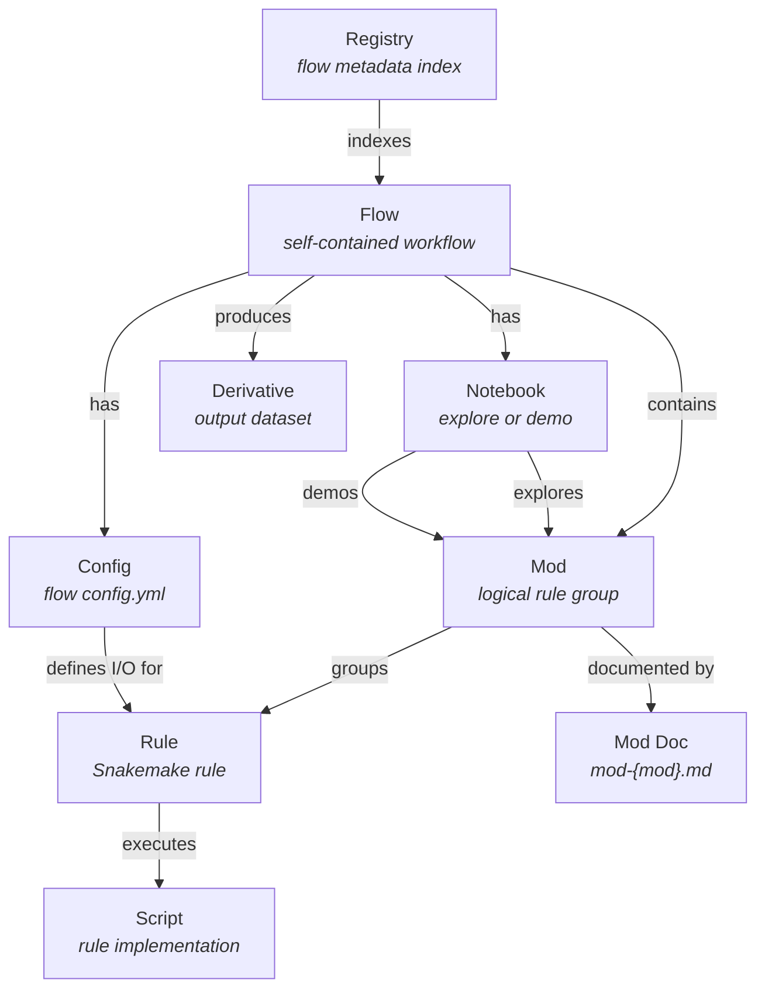
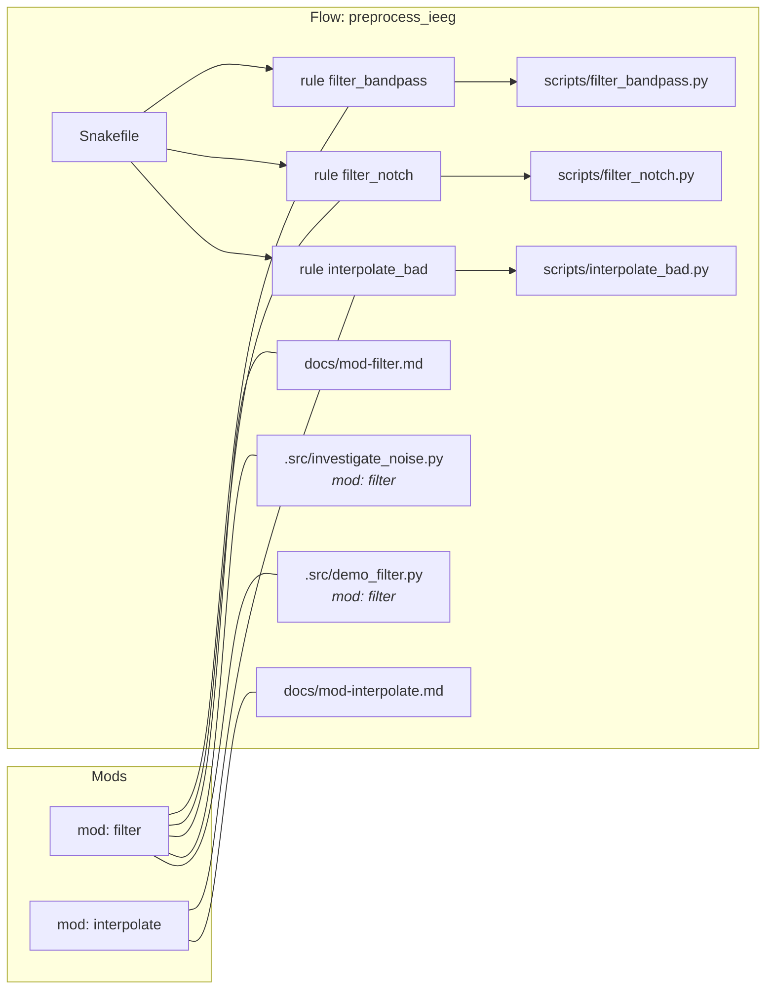
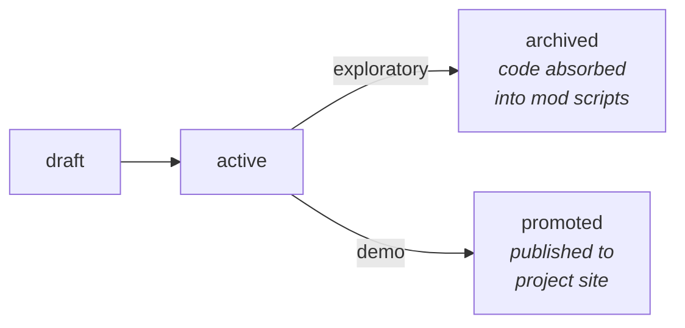

# pipeio: Ontology

## Concepts

pipeio manages a hierarchy of **flows**, **mods**, and their artifacts. Each concept maps to a filesystem convention, a registry entry, and a set of MCP tools.

### Flow

A **flow** is the primary unit of work — a self-contained computational workflow with its own Snakefile, config, notebooks, scripts, and derivative output. Flow names are globally unique.

The flow's **derivative directory** (`derivatives/{flow}/`) is a datalad subdataset containing all pipeline outputs, organized by subject/session.

### Mod

A **mod** (module) is a logical grouping of Snakemake rules within a flow. Mods are identified by rule name prefix: rules named `filter_bandpass`, `filter_notch` belong to mod `filter`. Each mod has:
- One or more rules (in Snakefile or `rules/{mod}.smk`)
- A script per rule (`scripts/{rule}.py`)
- Documentation (`docs/mod-{mod}.md`)
- Optionally, a notebook investigating or demoing its outputs

### Notebook

Notebooks serve two lifecycles within a flow:
- **Exploratory** (`kind: investigate/explore`) — prototypes, absorbed into mod scripts when done
- **Demo** (`kind: demo/validate`) — showcases mod outputs, published to the project site

### Rule

A Snakemake rule defines one processing step. Rules are grouped into mods by naming convention. Complex mods can split rules into `rules/{mod}.smk` files included by the main Snakefile.

## Flow Directory Structure

```
code/pipelines/{flow}/
├── Snakefile                      # workflow definition (includes rules/*.smk)
├── config.yml                     # input/output dirs, registry groups
├── Makefile                       # convenience targets (delegates to pipeio CLI)
├── rules/                         # optional: per-mod rule files
│   ├── filter.smk                 #   included by Snakefile
│   └── hpclayer.smk               #   complex mods get their own file
├── scripts/                       # rule scripts
│   ├── filter_bandpass.py
│   ├── filter_notch.py
│   └── hpclayer_detect.py
├── docs/                          # flow-local documentation (source of truth)
│   ├── index.md                   #   flow overview
│   ├── mod-filter.md              #   per-mod docs
│   └── mod-hpclayer.md
└── notebooks/                     # notebook workspace
    ├── notebook.yml               #   config: entries, kernel, publish settings
    ├── .src/                      #   agent territory (percent-format .py)
    │   ├── investigate_noise.py
    │   └── demo_filter.py
    ├── .myst/                     #   generated MyST markdown
    │   ├── investigate_noise.md
    │   └── demo_filter.md
    ├── investigate_noise.ipynb    #   human-facing (Jupyter Lab)
    └── demo_filter.ipynb
```

## Derivative Structure

```
derivatives/{flow}/
├── {flow}_registry.yml            # output registry (groups, members, paths)
├── sub-01/
│   └── {datatype}/
│       └── sub-01_*_{suffix}.{ext}
├── sub-02/
│   └── ...
└── all/                           # cross-subject aggregates (optional)
```

## Published Documentation

`docs_collect` publishes flow-local docs to the project site:

```
docs/pipelines/{flow}/
├── index.md                       # flow overview (from flow/docs/index.md)
├── mods/
│   ├── filter.md                  # mod docs (from flow/docs/mod-filter.md)
│   └── hpclayer.md
├── notebooks/
│   ├── nb-investigate_noise.md    # MyST notebooks
│   └── nb-demo_filter.html       # rendered demo notebooks
└── scripts/
    ├── filter_bandpass.py         # rule scripts (syntax-highlighted by MkDocs)
    └── hpclayer_detect.py
```

## Entity Relationships



## Naming Conventions



## Lifecycle States

### Flow lifecycle
```
scaffold → develop → validate → production
```

### Notebook lifecycle


### Mod lifecycle
```
discover → implement → document → validate (contracts) → production
```

## Registry Schema

```yaml
# .projio/pipeio/registry.yml
flows:
  preprocess_ieeg:
    name: preprocess_ieeg
    code_path: code/pipelines/preprocess_ieeg
    config_path: code/pipelines/preprocess_ieeg/config.yml
    doc_path: docs/pipelines/preprocess_ieeg
    app_type: snakemake
    mods:
      filter:
        name: filter
        rules: [filter_bandpass, filter_notch]
        doc_path: code/pipelines/preprocess_ieeg/docs/mod-filter.md
      interpolate:
        name: interpolate
        rules: [interpolate_bad]
        doc_path: null
```

## Modkey Citation Format

Mods are citable in manuscripts via BibTeX:

```
@misc{preprocess_ieeg_mod-filter,
  title  = {mod: flow=preprocess_ieeg mod=filter},
  author = {project_name},
  year   = {2026},
  note   = {doc_path=docs/pipelines/preprocess_ieeg/mods/filter.md; rules=filter_bandpass, filter_notch},
}
```

Referenced in pandoc markdown as `[@preprocess_ieeg_mod-filter]`.

## MCP Tool Categories

| Category | Tools | Purpose |
|----------|-------|---------|
| Flow discovery | `flow_list`, `flow_status`, `registry_scan`, `registry_validate` | Find and inspect flows |
| Flow management | `flow_fork`, `flow_deregister` | Create variants, remove from registry |
| Notebook lifecycle | `nb_status`, `nb_create`, `nb_update`, `nb_sync`, `nb_sync_flow`, `nb_diff`, `nb_scan`, `nb_read`, `nb_audit`, `nb_lab`, `nb_publish`, `nb_analyze`, `nb_exec`, `nb_pipeline` | Full notebook workflow |
| Mod management | `mod_list`, `mod_context`, `mod_resolve`, `mod_create` | Discover and scaffold mods |
| Rule authoring | `rule_list`, `rule_stub`, `rule_insert`, `rule_update` | Safe Snakefile editing |
| Config authoring | `config_read`, `config_patch`, `config_init` | Flow config management |
| Contracts | `contracts_validate`, `cross_flow`, `completion` | I/O validation |
| Documentation | `docs_collect`, `docs_nav`, `mkdocs_nav_patch`, `modkey_bib` | Site publishing |
| Execution | `run`, `run_status`, `run_dashboard`, `run_kill` | Snakemake session management |
| Inspection | `target_paths`, `dag_export`, `log_parse` | Path resolution and debugging |
