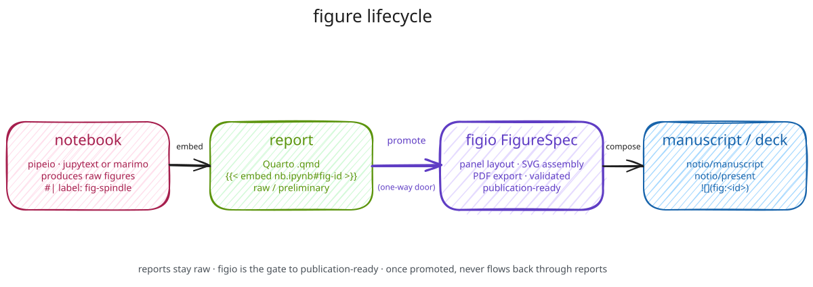

# Quarto-Powered Executable Reports

**Status:** draft
**Date:** 2026-04-18

## 1. Problem

[Deliverables spec](deliverables.md) defines three artifact types: **reports**, **presentations**, **posters**. Presentations are now presentio section trees; posters are still a manual markdown convention; **reports** currently sit in an awkward middle state.

A report is an aggregate: it pulls together questio question state, notio `result` notes, figio figures, and pipeio flow status into a single document for an external audience (supervisor, lab meeting, funder). Today:

- `questio-report` skill generates static markdown
- The markdown is stale the moment a pipeline reruns or a result note is added
- Rebuilding means re-running the skill and hoping the LLM does the same thing
- Figures are embedded by path (brittle) or omitted (common)

Every property a good report should have — **re-executes against current state, caches what's unchanged, embeds live notebook outputs, respects the pandoc bibliography chain** — lines up with what Quarto already does. This spec introduces a Quarto backend for the reports layer only. Presentations, posters, manuscripts, result notes, and notebooks are out of scope.

## 2. Design Principles

1. **Reports are reactive, notes are atomic.** Reports re-execute on build; result notes stay pure markdown. The two layers are deliberately different tools.
2. **Reports carry preliminary figures, not composed ones.** A report sits one level below the manuscript layer. Its figures are raw notebook outputs — useful for showing work in progress to a supervisor or lab meeting, not publication-ready. Figio's composition model (panel layout, SVG assembly, PDF export) is deliberately **out of the report path** — figio targets manuscripts and decks, where figures have matured into final form.
3. **Quarto is a backend, not a takeover.** Projio's existing render chain (pandoc + CSL via `.projio/render.yml`) still owns manuscripts, decks, and prose pages. Quarto runs only inside `docs/deliverables/reports/`.
4. **Embed, don't re-execute.** A report references executed pipeio notebooks via Quarto's `embed` shortcode. The notebook was already executed by `pipeio_nb_exec`; the report just pulls the labeled cell. No duplicate computation.
5. **Runner-aware.** Quarto must render inside the project's compute environment (conda or pixi) so embedded Python/R chunks resolve the same way as pipeio.
6. **Graceful degradation.** Projects without Quarto installed can still author `.md` reports. `report_build` reports "quarto not available; run `pip install quarto-cli`" instead of silently failing.
7. **Deliverables-native.** Reports live at `docs/deliverables/reports/<name>/`, matching the `<name>/` subdirectory pattern decks use. No surprising new location.

## 3. Directory Layout

```
docs/deliverables/
  reports/
    index.md                             # auto-generated report list (questio_docs_collect)
    <name>/                              # one directory per report
      report.qmd                         # Quarto source (executable)
      _quarto.yml                        # per-report Quarto config (optional override)
      _freeze/                           # Quarto's execution cache (gitignored)
      _files/                            # Quarto's generated assets (gitignored)
      build/
        report.html                      # primary output
        report.pdf                       # optional (quarto render --to pdf)
```

Report-level `_quarto.yml` is optional. A project-level `.projio/render/quarto.yml` supplies defaults (bibliography, CSL, theme, execution engine) that each report inherits.

Single-file reports (`report.qmd` without a subdirectory) are allowed but discouraged — the subdirectory gives Quarto's `_freeze/` and `_files/` a home without polluting `docs/deliverables/reports/`.

## 4. Frontmatter Schema

Quarto uses YAML frontmatter natively. Projio adds four fields on top of Quarto's own schema:

```yaml
---
title: "Weekly Progress Report — Week of 2026-04-14"
author: "Arash Shahidi"
date: 2026-04-19
format:
  html:
    toc: true
    code-fold: true
    theme: cosmo
  pdf:
    documentclass: article
bibliography: "../../../.projio/render/compiled.bib"  # inherits from render.yml
csl: "../../../.projio/render/csl/apa.csl"

# projio-specific fields (read by report_build and questio_docs_collect)
type: report
audience: supervisor             # supervisor | team | conference | public
period: "2026-04-14 to 2026-04-19"
questions: [q-swr-detection, q-spindle-density-age]
results: [result-arash-20260415-..., result-arash-20260417-...]
source_flows: [preprocess_ieeg, detect_swr]
---
```

The bibliography and CSL paths resolve via the existing projio render chain — same `compiled.bib` that manuscripts and decks use, so citations are consistent across all deliverable types.

## 5. Figure sources



The **notebook is the figure source** for reports. A report reaches directly into an executed pipeio notebook for its plots — these are working figures, not composed ones. If a particular figure later matures to publication quality, it gets promoted to a FigureSpec under figio and enters the manuscript/deck path instead; it does not continue to flow through reports.

Two mechanisms are supported — one primary, one fallback — chosen by notebook backend:

| Source | Mechanism | When to use |
|---|---|---|
| **Primary** | Quarto `` shortcode referencing a labeled cell | jupytext percent-format or native `.ipynb` notebooks executed via `pipeio_nb_exec` |
| **Fallback** | `` pointing to a file written by `pipeio_nb_extract` | marimo notebooks; ad-hoc analyses without a pipeio flow; notebooks that no longer execute |

Design choices rejected (recorded here so future contributors don't re-open them):

- **In-report regeneration** (Quarto code chunks that re-run the analysis inside the report): rejected. Duplicates analysis logic across the notebook and the report; violates the delegation model ("no subsystem embeds content it doesn't own"). A report regenerating a figure is the report doing pipeio's job.
- **Dedicated report notebook** (a separate notebook per report containing only narrative figures): rejected. Adds a new artifact type without solving duplication — data loading and preprocessing inevitably get copied from the analysis notebook. Gives no advantage over primary embed once analysis cells are labeled.

### 5a. Primary: Quarto embed

Quarto's [`embed` shortcode](https://quarto.org/docs/authoring/notebook-embed.html) is the main path. A report embeds a labeled cell from an executed notebook:

```markdown
## Spindle density declines with age



Across N=18 subjects, we observed a significant negative correlation
(r=-0.42, p=0.003) between subject age and per-minute spindle count
during NREM sleep.
```

Requirements:
- Notebook must be jupytext percent-format or native `.ipynb`
- Notebook must have been executed (`pipeio_nb_exec`) so cached outputs live in the `.ipynb` JSON
- Cell must be labeled: `#| label: fig-spindle-density-age` in the code chunk header
- Optional caption override: ``

Re-rendering the report is cheap — Quarto pulls the cached cell output without re-executing. Freshness is tied to when `pipeio_nb_exec` last ran the notebook, which is the correct coupling.

### 5b. Fallback: exported figure files

For notebooks that Quarto cannot embed (primarily marimo), `pipeio_nb_extract` extracts figures by cell label to PNG/SVG files. The report references these directly:

```markdown

```

This path loses the single-source-of-truth property (the figure file can drift from notebook code) but preserves report portability: a six-month-old report still renders even if the notebook is gone.

### 5c. report_build validation

`report_build` parses the `.qmd` for both embed shortcodes and image references, then validates preconditions before invoking `quarto render`:

- Embed targets: notebook file exists, is `.ipynb`, is executed, cell label resolves
- Image refs under `figures/`: file exists
- Bibliography resolves **if the report body contains at least one citation** (`@citekey`); a report with no citations builds cleanly even when `bibliography:` points at a non-existent file
- Missing preconditions reported up-front with actionable errors rather than surfacing Quarto's own failure modes

## 6. report_build MCP tool

New tool in `src/projio/mcp/report.py`, registered in `server.py`:

```python
report_build(name: str, format: str = "html") -> JsonDict
```

Execution chain:
1. Resolve `docs/deliverables/reports/<name>/report.qmd` (or flat `.qmd`)
2. Validate: file exists, frontmatter parses, bibliography path resolves
3. Detect runner via `.projio/config.yml` `code.runner` — pixi or conda
4. Invoke `quarto render report.qmd --to <format>` inside the project's compute env:
   - pixi: `pixi run [-e <env>] quarto render ...`
   - conda: `conda run -n <env> quarto render ...`
5. Read `build/report.<ext>` metadata, return path + render log

Additional tools (phase 2):
- `report_list()` — enumerate `docs/deliverables/reports/*/report.qmd`
- `report_status(name)` — staleness check (report mtime vs. source notebooks, result notes, figio outputs)
- `report_init(name, template)` — scaffold a new report with questio/result preamble filled in from current state
- `report_validate(name)` — dry-run preflight without `quarto render`

Phase 1 ships only `report_build` + `report_init`.

## 7. Relationship to existing layers

```
questio_status       ──→  report.qmd  (question + hypothesis state, templated on init)
result notes         ──→  report.qmd  (cite via @result-id or embed verbatim)
pipeio notebooks     ──→  report.qmd  ()
biblio (compiled.bib)──→  report.qmd  (bibliography: inherits from render.yml)

report.qmd           ───  docs/deliverables/reports/<name>/build/report.html
```

**Figio is deliberately absent from the report path.** Figio composes notebook outputs into publication-ready figures for manuscripts and decks — that is one layer above reports. A figure's lifecycle is: (1) produced by a pipeio notebook, (2) embedded raw in reports while exploratory, (3) promoted to a FigureSpec under figio once it matures, (4) carried into manuscripts and decks from there. Reports never consume figio outputs; promotion is a one-way door.

Reports **reference upstream** objects (questions, results, flows) via frontmatter exactly like the existing deliverables schema. No new linking direction.

## 8. Runner integration

The existing `code.runner` resolution (conda | pixi, auto-detected from `pixi.toml`) extends to Quarto:

```yaml
# .projio/config.yml
code:
  runner: pixi
  envs:
    default: ""            # pixi default env
    report: ""             # optional override for quarto execution
```

Resolution chain for the `quarto` binary:
1. `code.envs.report` if set → `<runner> run [-e <env>] quarto`
2. `code.envs.default` if set → same
3. `quarto` on PATH → bare invocation
4. Error: "quarto not found — install with `pip install quarto-cli` or add to project env"

This matches the existing snakemake resolution chain in pipeio — same mental model, no new config surface.

## 9. Skills integration

One new skill plus an evolution of an existing one.

**New skill: `report-build`** (`src/projio/data/skills/report-build/SKILL.md`)
- Triggered by "write a progress report", "generate a supervisor update"
- Workflow:
  1. `questio_status()` to gather current question state
  2. `note_list(type="result", since=<period>)` to collect recent results
  3. `pipeio_flow_status()` for flow-level state
  4. `report_init(name, template=<progress|update|milestone>)` — scaffolds `report.qmd` with preamble filled in
  5. Agent drafts prose in the body; uses `` for notebook figures
  6. `report_build(name)` to render

**Evolved skill: `questio-report`** gains a `--format quarto` mode that emits `report.qmd` instead of static `.md`. Existing markdown behavior preserved for back-compat and for projects without Quarto installed.

## 10. Out of scope

Explicitly **not** addressed by this spec:
- **Result notes.** Stay pure markdown. Figure embedding in result notes is a separate pipeio/figio wiring concern, tracked separately.
- **Figio.** Reports do not consume figio outputs; figio remains focused on composing publication-ready figures for manuscripts and decks.
- **Manuscripts.** Pandoc + projio's existing render chain remain the manuscript backend. Quarto's journal templates could be a separate manuscripto spec later.
- **Decks.** Presentio has its own spec and its own backends (Marp, revealjs via pandoc).
- **Docs site.** MkDocs Material stays.
- **In-report figure regeneration.** Reports never re-run analysis code; figures come from labeled notebook cells (primary) or exported files (fallback). See §5.

## 11. Migration path

For existing projects (e.g., pixecog) with ad-hoc reports:
1. `projio sync` writes `.projio/render/quarto.yml` defaults if missing
2. Existing `.md` reports under `docs/deliverables/reports/` keep working
3. New reports scaffold as `.qmd` via `report_init`
4. No forced migration — reports can be rewritten to `.qmd` as they're touched

## 12. Design decisions (resolved)

### 12a. Quarto version pin → runtime check, min-version in project config

**Decision:** `report_build` runs a runtime `quarto --version` check against a minimum declared in `.projio/render/quarto.yml`. No pyproject optional-dependency on `quarto-cli`.

**Rationale:** `quarto-cli` on PyPI is a thin wrapper around the actual Quarto binary; most users install via homebrew, apt, nix, pixi, or direct download. A pyproject optional-dep is the wrong install channel — users who already have quarto don't appreciate pip "installing" a duplicate, and users who want the official installer don't get value from the pyproject declaration. A runtime check is the thing that actually matters: it catches stale installs and gives a specific, actionable error.

```yaml
# .projio/render/quarto.yml
min_version: "1.5"
```

`report_build` caches the version probe in-process so subsequent builds in the same MCP session don't re-shell-out. Error surface:

```
quarto ≥ 1.5 required; found 1.3.450.
Install: https://quarto.org/docs/get-started/
```

### 12b. Cross-project embeds → phase 2, shape sketched

**Decision:** Deferred to phase 2. Not blocking phase 1. Shape of the answer:

- New tools: `report_import_notebook(name, from_project, rel_path)` and `report_refresh_import` / `report_freeze_import`, mirroring presentio's import trio
- Fetch an executed `.ipynb` from another project via `worklog_read_file`
- Cache at `docs/deliverables/reports/<name>/imports/<project>-<hash>.ipynb`
- Sidecar provenance: `imports/<project>-<hash>.ipynb.import.yaml` with `imported_from_project`, `imported_from_commit`, `import_mode: reference | freeze`, `imported_at`
- Report embeds cells via ``

**Why this works:** Quarto's embed only needs the executed `.ipynb` JSON with cached outputs — no re-execution in the host project. The source project already ran the notebook; the host is just pulling cell outputs. Host compute environment is irrelevant for the embed path.

**What to watch before phase 2 lands:** cache invalidation policy (what triggers a refresh?), cross-project bibliography resolution (cited keys in the embedded cell may not resolve in the host's bib), and figure caption/numbering across embedded cells.

### 12c. `_freeze/` → gitignored by default

**Decision:** `_freeze/` and `_files/` are added to `.gitignore` by `projio sync` under the `# >>> projio >>>` managed block. No DataLad annex by default. Users who want durable caches (rare) can negate the ignore per-project.

**Rationale:** Projio reports embed from *already-executed* pipeio notebooks — `` pulls cached cell outputs from the source `.ipynb`, it does not re-execute. That means Quarto's `_freeze/` for a projio report mostly caches final HTML assembly, not analysis computation. It's pure performance — small, regenerable in seconds, not load-bearing. The DataLad annex overhead and the symlink-to-cache dance aren't worth it for this use case. Keep it simple.

```gitignore
# >>> projio >>>
# ...existing entries...
docs/deliverables/reports/*/_freeze/
docs/deliverables/reports/*/_files/
# <<< projio <<<
```
