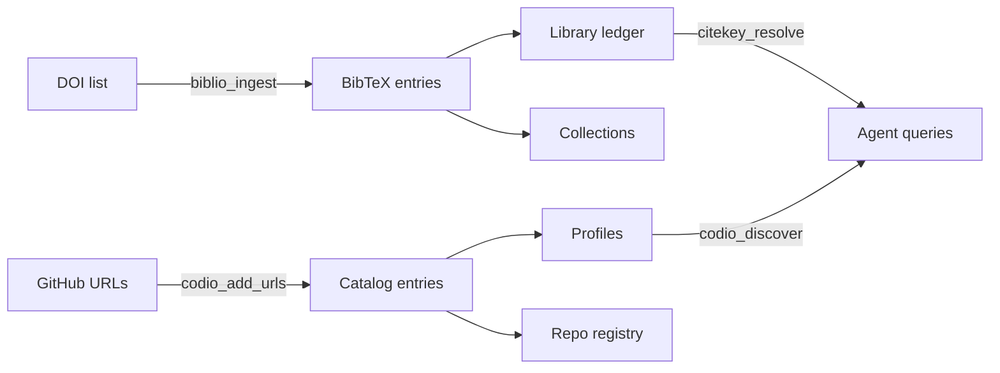

# Agent-Driven Literature & Code Ingestion

This tutorial shows how to use Claude Code (or any MCP-capable agent) to ingest papers and code libraries into a projio workspace — turning a curated reading list into queryable, structured project knowledge.

## Prerequisites

- A projio workspace (`projio init .`)
- biblio and codio components activated (`projio add biblio && projio add codio`)
- The MCP server configured (`.mcp.json` in place — see [Configure the MCP Server](../how-to/mcp.md))
- Agent permissions configured (`projio add claude` — see [Agent Safety & Permissions](../explanation/agent-safety.md))

## The scenario

You have a research topic — say, **travelling wave detection methods** — and a curated list of DOIs and GitHub repositories. You want to:

1. Ingest the papers into your bibliography
2. Register the code libraries in your code intelligence registry
3. Tag and organize everything for later discovery

With projio's MCP tools, the agent handles this in a single conversation.

## Step 1: Ingest papers by DOI

Give Claude Code a list of DOIs and ask it to ingest them:

````
You: Ingest these papers into biblio with tag "travelling_waves" and
     add them to a collection called "phase-methods":

10.1038/nn.4046
10.1038/nn.4494
10.1016/j.neuron.2013.08.006
10.1152/jn.00369.2007
10.1016/j.jneumeth.2011.10.005
````

The agent calls `biblio_ingest`:

```json
{
  "dois": [
    "10.1038/nn.4046",
    "10.1038/nn.4494",
    "10.1016/j.neuron.2013.08.006",
    "10.1152/jn.00369.2007",
    "10.1016/j.jneumeth.2011.10.005"
  ],
  "tags": ["travelling_waves"],
  "status": "unread",
  "collection": "phase-methods"
}
```

The tool returns:

```json
{
  "citekeys": [
    "muller_2018_CorticalTravelling",
    "davis_2020_SpontaneousWaves",
    "rubino_2006_PropagatingWaves",
    "rubino_2007_PhaseGradient",
    "townsend_2011_PhaseGradient"
  ],
  "count": 5,
  "output_bib": "/path/to/project/bib/srcbib/imported.bib",
  "collection": "phase-methods"
}
```

!!! info "Under the hood: `biblio_ingest`"

    The tool executes a multi-step pipeline:

    1. **DOI parsing** — Each DOI is normalized (strips `https://doi.org/` prefixes)
    2. **OpenAlex enrichment** — Queries the OpenAlex API for each DOI to resolve title, authors, year, journal, and abstract
    3. **Citekey generation** — Assigns `{author}_{year}_{TitleWords}` citekeys with automatic deduplication (appends `2`, `3`, etc. on collision)
    4. **BibTeX writing** — Appends `@article{...}` entries to `bib/srcbib/imported.bib`
    5. **Library ledger** — Sets `status: unread` and `tags: [travelling_waves]` in `bib/config/library.yml`
    6. **Collection** — Creates the "phase-methods" collection in `bib/config/collections.json` and adds the citekeys

    After ingestion, run `biblio merge` to fold the imported entries into `bib/main.bib` for downstream use by docling and GROBID.

## Step 2: Register code libraries

Now give the agent the GitHub URLs:

````
You: Add these libraries to the codio registry:

https://github.com/mne-tools/mne-python
https://github.com/neurodsp-tools/neurodsp
https://github.com/NeuralEnsemble/elephant
https://github.com/kemerelab/ghostipy
https://github.com/preraulab/multitaper_toolbox
https://github.com/mathLab/PyDMD
````

The agent calls `codio_add_urls`:

```json
{
  "urls": [
    "https://github.com/mne-tools/mne-python",
    "https://github.com/neurodsp-tools/neurodsp",
    "https://github.com/NeuralEnsemble/elephant",
    "https://github.com/kemerelab/ghostipy",
    "https://github.com/preraulab/multitaper_toolbox",
    "https://github.com/mathLab/PyDMD"
  ]
}
```

The tool returns:

```json
{
  "results": [
    {"url": "https://github.com/mne-tools/mne-python", "name": "mne_python", "status": "added", "repo_id": "mne-tools--mne-python"},
    {"url": "https://github.com/neurodsp-tools/neurodsp", "name": "neurodsp", "status": "added", "repo_id": "neurodsp-tools--neurodsp"},
    {"url": "https://github.com/NeuralEnsemble/elephant", "name": "elephant", "status": "added", "repo_id": "neuralensemble--elephant"},
    {"url": "https://github.com/kemerelab/ghostipy", "name": "ghostipy", "status": "added", "repo_id": "kemerelab--ghostipy"},
    {"url": "https://github.com/preraulab/multitaper_toolbox", "name": "multitaper_toolbox", "status": "added", "repo_id": "preraulab--multitaper_toolbox"},
    {"url": "https://github.com/mathLab/PyDMD", "name": "pydmd", "status": "added", "repo_id": "mathlab--pydmd"}
  ]
}
```

!!! info "Under the hood: `codio_add_urls`"

    For each URL, the tool:

    1. **Parses the URL** — Extracts `owner/repo` to derive a `repo_id` and library `name` (lowercased, hyphens to underscores)
    2. **Fetches GitHub metadata** — Calls the GitHub API to get: language, license (SPDX), description, and topic tags
    3. **Creates catalog entry** — Writes to `.projio/codio/catalog.yml` with kind `external_mirror`, the detected language, license, and summary
    4. **Creates profile entry** — Writes to `.projio/codio/profiles.yml` with `priority: tier2`, `status: candidate`, and GitHub topics as capability tags
    5. **Sets runtime policy** — Python repos get `runtime_import: pip_only` and `decision_default: wrap`; non-Python repos get `reference_only` and `new`
    6. **Registers repository** — Writes to `.projio/codio/repos.yml` with the URL, hosting provider, and storage type

    Existing libraries are skipped (idempotent). If a URL can't be parsed, it's reported as an error without blocking other URLs.

## Step 3: Verify and explore

Now you can query what was ingested using the read tools.

### Check a paper

````
You: What do we have on Muller 2018?
````

The agent calls `citekey_resolve(["muller_2018_CorticalTravelling"])` and gets back the full metadata: title, authors, year, DOI, tags, and library status.

For deeper context (docling excerpt, GROBID references), the agent can call `paper_context("muller_2018_CorticalTravelling")`.

### Check a library

````
You: What's in the registry for mne_python?
````

The agent calls `codio_get("mne_python")` and gets the full merged record: language, license, repo URL, capabilities, priority, runtime policy, and any curated notes.

### Discover by capability

````
You: Which libraries support phase analysis?
````

The agent calls `codio_discover("phase analysis")` to search across capability tags and descriptions.

!!! tip "Combining read and write tools"

    The real power is in composition. After ingesting, the agent can:

    - Call `codio_discover("multitaper spectral estimation")` to find relevant libraries
    - Call `paper_context` on related papers to understand the algorithms
    - Call `note_search("wave detection methods")` to check prior design decisions
    - Then write a new note with `note_create` summarizing the analysis

    This is the **search-before-creation** workflow — the agent builds on existing project knowledge rather than starting from scratch.

## Step 4: Bulk-update library metadata

After reviewing the ingested papers, update their status:

````
You: Mark the Muller and Davis papers as "reading" with high priority.
````

The agent calls `biblio_library_set`:

```json
{
  "citekeys": ["muller_2018_CorticalTravelling", "davis_2020_SpontaneousWaves"],
  "status": "reading",
  "priority": "high"
}
```

!!! info "Under the hood: `biblio_library_set`"

    Updates the `bib/config/library.yml` ledger file. Each citekey's entry is updated with the specified fields. Fields not provided are left unchanged.

    Valid statuses: `unread`, `reading`, `processed`, `archived`.
    Valid priorities: `low`, `normal`, `high`.

## Putting it all together

A single conversation with Claude Code can transform a curated list of DOIs and URLs into a fully structured, queryable knowledge layer:



!!! note "What the agent sees"

    From the agent's perspective, the projio MCP tools are just another set of callable functions — like file read/write or web search. The agent doesn't need to know about YAML files, BibTeX syntax, or OpenAlex APIs. It calls `biblio_ingest` with DOIs and gets back citekeys. It calls `codio_add_urls` with URLs and gets back library names.

    The structured output means the agent can chain tools naturally: ingest papers, then resolve their citekeys, then search for related notes, then create a summary — all in one conversation.

## Step 5: Process and index

After ingestion, the agent can run the full pipeline without leaving the conversation:

**Merge imported entries:**

The agent calls `biblio_merge()` to fold `bib/srcbib/*.bib` into `bib/main.bib`:

```json
{"n_sources": 2, "n_entries": 5, "out_bib": "/path/to/project/bib/main.bib"}
```

**Extract full text with Docling:**

For each paper that has a PDF, the agent calls `biblio_docling(citekey)`:

```json
{"citekey": "muller_2018_CorticalTravelling", "md_path": "...", "json_path": "..."}
```

**Extract references with GROBID:**

The agent can first check the server with `biblio_grobid_check()`, then call `biblio_grobid(citekey)` for each paper:

```json
{"citekey": "muller_2018_CorticalTravelling", "header_path": "...", "references_path": "..."}
```

**Rebuild the search index:**

Finally, the agent calls `indexio_build()` to re-index everything for semantic search:

```json
{"store": "default", "persist_directory": "...", "source_stats": {...}}
```

!!! tip "CLI equivalents"

    These MCP tools correspond to the CLI commands `biblio merge`, `biblio docling`, `biblio grobid`, and `indexio build`. The MCP tools let the agent run the full pipeline autonomously in a single conversation.

## Next steps

- Write curated library notes in `docs/reference/codelib/libraries/` for the codio entries
