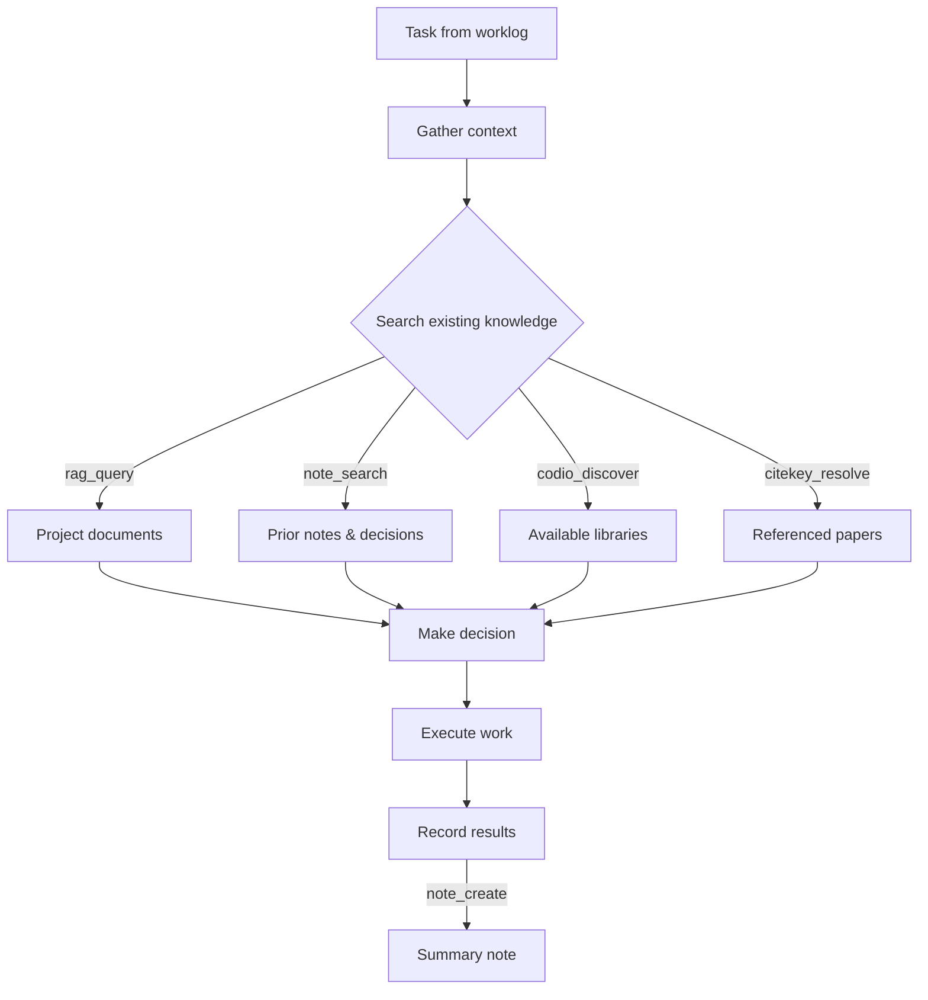

# Agent Orchestration

This tutorial demonstrates a full multi-tool MCP session where an agent uses all ecosystem components together — the pattern that worklog uses to execute scoped agent runs.

## The session pattern

A typical agent session follows the **search-before-creation** principle:



## Prerequisites

- Full ecosystem installed (`pip install "projio[all]"`)
- All subsystems initialized (see [Ecosystem Overview](ecosystem-overview.md))
- MCP server connected (`projio mcp-config -C . --yes`)
- Agent permissions configured (`projio add claude` — see [Agent Safety & Permissions](../explanation/agent-safety.md))
- An indexed corpus (`indexio build`)

## Scenario: Evaluate a new analysis method

Worklog has promoted a task: *"Evaluate phase gradient vs optical flow for travelling wave detection — recommend an approach and identify required libraries."*

### Phase 1: Gather context

The agent starts by understanding what the project already knows.

**Check project state:**

````
You: What's the current state of the project?
````

Agent calls `project_context()` → gets project name, key paths, config, README excerpt.

Agent calls `runtime_conventions()` → gets Makefile targets, available commands.

**Search existing knowledge:**

````
You: What do we already have on travelling wave detection methods?
````

Agent calls `rag_query("travelling wave detection methods", k=8)` → finds relevant passages from papers and docs.

Agent calls `note_search("wave detection")` → finds prior idea notes and design decisions.

Agent calls `codio_discover("phase analysis wave detection")` → finds libraries with relevant capabilities.

### Phase 2: Deep dive on specific resources

Based on search results, the agent drills into specifics.

**Paper context:**

````
Agent thinks: The RAG results reference muller_2018 and davis_2020.
              Let me get full paper context.
````

Agent calls `paper_context("muller_2018_CorticalTravelling")` → gets title, abstract, docling excerpt, GROBID references.

Agent calls `paper_context("davis_2020_SpontaneousWaves")` → same for the second paper.

**Library details:**

````
Agent thinks: codio_discover found mne_python and neurodsp.
              Let me check their full records.
````

Agent calls `codio_get("mne_python")` → gets language, license, capabilities, priority, runtime policy.

Agent calls `codio_get("neurodsp")` → same for the second library.

**Prior notes:**

Agent calls `note_list(note_type="idea")` → checks for related ideas.

Agent calls `note_read("docs/log/idea/idea-arash-20260310.md")` → reads a related idea note about optical flow approaches.

### Phase 3: Identify gaps

**Check unresolved references:**

Agent calls `paper_absent_refs("muller_2018_CorticalTravelling")` → finds references in the paper that aren't in the bibliography yet.

**Check library coverage:**

Agent calls `codio_list(capability="optical_flow")` → checks if any registered library handles optical flow.

Agent calls `codio_vocab()` → confirms the controlled vocabulary for capability tags.

### Phase 4: Take action

Based on the analysis, the agent:

**Ingest missing papers:**

Agent calls `biblio_ingest(dois=["10.1038/s41593-019-0462-y"], tags=["optical_flow", "travelling_waves"])` → adds the missing reference.

**Register a new library:**

Agent calls `codio_add_urls(urls=["https://github.com/opencv/opencv-python"])` → adds OpenCV as a candidate for optical flow.

**Record the decision:**

Agent calls `note_create(note_type="task", title="Implement phase gradient pipeline using MNE-Python")`:

```json
{
  "path": "docs/log/task/task-arash-20260318-150045.md",
  "type": "task"
}
```

Agent calls `note_update` to add structured metadata:

```json
{
  "path": "docs/log/task/task-arash-20260318-150045.md",
  "fields": "{\"status\": \"open\", \"tags\": [\"phase_gradient\", \"mne_python\", \"travelling_waves\"], \"priority\": \"high\"}"
}
```

**Update library status:**

Agent calls `biblio_library_set(citekeys=["muller_2018_CorticalTravelling"], status="reading", priority="high")` → marks the key paper for reading.

### Phase 5: Generate report

The agent produces a structured summary:

````
## Wave Detection Method Evaluation

### Recommendation: Phase gradient (via MNE-Python)

**Evidence:**
- muller_2018 demonstrates phase gradient is robust for cortical data
- MNE-Python (tier1, pip_only) has built-in phase analysis
- neurodsp provides complementary spectral tools

**Alternatives considered:**
- Optical flow (OpenCV) — better for video, less suited to electrode arrays
- Custom implementation — not justified given existing library support

**Actions taken:**
- Ingested 1 missing reference (doi:10.1038/s41593-019-0462-y)
- Registered opencv-python in codio (reference_only)
- Created task: "Implement phase gradient pipeline using MNE-Python"
- Marked muller_2018 as reading/high priority

**Next steps:**
- Read muller_2018 in detail
- Prototype phase gradient extraction with MNE
- Index new materials: `indexio build`
````

## Worklog integration

This entire session maps to a single worklog **Run**:

| Worklog concept | Projio implementation |
|----------------|----------------------|
| Task input | `note_read` on the promoted task note |
| Context gathering | `rag_query` + `note_search` + `codio_discover` |
| Knowledge retrieval | `paper_context` + `codio_get` |
| Actions | `biblio_ingest` + `codio_add_urls` + `note_create` |
| Report | Structured summary stored back via worklog |

### Agent execution rules

Following the worklog pipeline design:

1. **Each run is scoped to one project repo** — the agent operates within `PROJIO_ROOT`
2. **Default runs are read-only** — search and retrieval tools only
3. **Promoted tasks get write access** — ingestion, note creation, library registration
4. **Each run produces a structured report** — stored in worklog

For details on the two-layer security model (client permissions vs server scope), see [Agent Safety & Permissions](../explanation/agent-safety.md).

### Tool categories by access level

| Access | Tools |
|--------|-------|
| **Read-only** | `rag_query`, `rag_query_multi`, `corpus_list`, `note_list`, `note_latest`, `note_read`, `note_search`, `note_types`, `citekey_resolve`, `paper_context`, `paper_absent_refs`, `library_get`, `codio_list`, `codio_get`, `codio_registry`, `codio_vocab`, `codio_validate`, `codio_discover`, `project_context`, `runtime_conventions`, `site_detect`, `site_list`, `biblio_grobid_check` |
| **Write** | `note_create`, `note_update`, `biblio_ingest`, `biblio_library_set`, `biblio_merge`, `biblio_docling`, `biblio_grobid`, `codio_add_urls`, `indexio_build`, `site_serve`, `site_stop` |

Worklog can gate write tools based on task promotion status.

## Next steps

- [Agent-Driven Ingestion](agent-ingestion.md) — focused tutorial on paper and library ingestion
- [Site & Docs Workflow](site-workflow.md) — publish results and serve documentation
