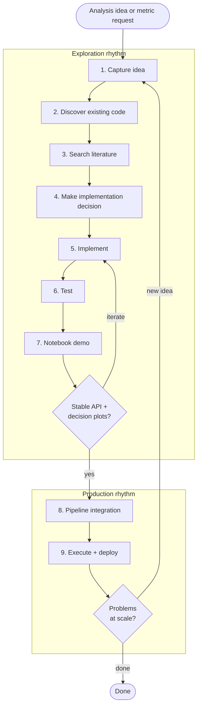

# Research Grand Routine

This tutorial describes the end-to-end agentic workflow for going from an analysis idea to a deployed, reproducible pipeline. It maps each phase to the projio MCP tools that support it, and shows how an agent can execute the workflow with minimal human steering.

## Two rhythms

The workflow has two distinct rhythms:

- **Exploration** (steps 1–7): hours to days, notebook-driven, individual. Goal: prove the idea works on a small slice of data.
- **Production** (steps 8–9): days to weeks, pipeline-driven, full dataset. Goal: operationalize and publish.

Do not enter the production rhythm until exploration has produced a stable, validated implementation and at least one decision plot confirming expected behavior.



## Prerequisites

- Full ecosystem: `pip install "projio[all]"` + `pip install pipeio`
- All subsystems initialized: `projio init -c full` (see [Ecosystem Overview](ecosystem-overview.md))
- MCP server connected and agent permissions configured
- Indexed corpora: code, docs, papers (`indexio build`)

## Skills and prompts

Each step below has a corresponding **skill** or **workflow prompt** that agents
can follow. Call `agent_instructions()` at session start — it returns discovered
skills and workflow prompts alongside the tool routing table.

| Resource | Steps covered | Path |
|----------|--------------|------|
| `idea-capture` skill | Step 1 | `docs/prompts/skills/idea-capture/SKILL.md` |
| `codelib-discovery` skill | Step 2 | `docs/prompts/skills/codelib-discovery/SKILL.md` |
| `literature-discovery` skill | Step 3 | `docs/prompts/skills/literature-discovery/SKILL.md` |
| `explore-idea` prompt | Steps 1-4 | `docs/prompts/workflows/explore-idea.md` |
| `implement-feature` prompt | Steps 5-7 | `docs/prompts/workflows/implement-feature.md` |
| `integrate-pipeline` prompt | Steps 8-9 | `docs/prompts/workflows/integrate-pipeline.md` |

Skills are granular (one step), prompts are composite (multiple steps). Use whichever
granularity fits the task.

---

## Step 1: Capture the idea

Every workflow starts with a structured note.

**Agent prompt:**
```
Create an idea note: "Evaluate phase gradient for travelling wave detection.
Success criteria: detect propagating waves in LFP with sub-electrode spatial resolution.
Target data: subjects with high-density grid recordings."
```

**MCP tools used:**

| Tool | Purpose |
|------|---------|
| `note_create(note_type="idea")` | Create the structured idea note |
| `project_context()` | Understand current project state |
| `pipeio_flow_list()` | See what pipelines already exist |

The idea note becomes the audit trail. Every subsequent decision should reference it.

---

## Step 2: Discover existing code

**Always do this before literature search.** The fastest path is reusing what exists.

**Agent prompt:**
```
What code do we already have for phase analysis and wave detection?
Check our libraries, codebase, and any mirrored repos.
```

**MCP tools used:**

| Tool | Purpose |
|------|---------|
| `codio_discover("phase analysis wave detection")` | Search registered libraries by capability |
| `rag_query("phase gradient wave detection", corpus="code")` | Semantic search over code corpus |
| `rag_query("travelling wave", corpus="codelib")` | Search mirrored reference libraries |
| `codio_get(name)` | Deep-dive on a specific candidate library |

**Decision output:** A ranked list of existing implementations with relevance scores.

---

## Step 3: Search literature (conditional)

**Do this when step 2 reveals gaps, ambiguity, or novel territory. Skip if a well-tested implementation already exists.**

**Agent prompt:**
```
What papers cover phase gradient methods for travelling wave detection?
Check our bibliography and find any missing key references.
```

**MCP tools used:**

| Tool | Purpose |
|------|---------|
| `rag_query("phase gradient travelling wave", corpus="papers")` | Search indexed papers |
| `paper_context(citekey)` | Get full context for a specific paper |
| `paper_absent_refs(citekey)` | Find unresolved references worth ingesting |
| `biblio_ingest(dois=[...])` | Ingest missing papers by DOI |
| `library_get(citekey)` | Check reading status |

Steps 2 and 3 often interleave: code discovery may surface a library whose docs reference a key paper, which reveals a better implementation. Treat them as a loop.

---

## Step 4: Make the implementation decision

Per feature or component, choose one:

| Decision | When |
|----------|------|
| `existing` | Stable internal implementation already covers it |
| `wrap` | Good external library; needs interface alignment |
| `new` | No suitable library, or APIs are unstable |
| `direct` | External library usable as-is, no wrapper needed |

**Agent prompt:**
```
Based on the discovery and literature results, recommend an implementation
approach for phase gradient wave detection. Record the decision.
```

**MCP tools used:**

| Tool | Purpose |
|------|---------|
| `codio_discover(query)` | Confirm recommendation with structured search |
| `note_create(note_type="task")` | Create implementation task with decision |
| `note_update(path, fields)` | Tag with decision, priority, references |
| `biblio_library_set(citekeys, status="reading")` | Mark key papers for reading |
| `codio_add_urls(urls)` | Register any new libraries discovered |

---

## Step 5: Implement

Write the code. The agent assists with implementation guided by discovered code and papers.

**Agent prompt:**
```
Implement phase gradient extraction. Use MNE-Python's phase analysis as the base.
Follow the patterns from our existing preprocessing code.
```

**MCP tools used:**

| Tool | Purpose |
|------|---------|
| `rag_query("phase gradient implementation", corpus="code")` | Find patterns to follow |
| `codio_get(name)` | Check library API details |
| `runtime_conventions()` | Verify build/test commands |

The agent writes code, using RAG to find existing patterns and library conventions.

---

## Step 6: Test

Correctness validation before any notebook work.

**Agent prompt:**
```
Write tests for the phase gradient implementation.
Include shape checks, known-signal tests, and edge cases.
```

Tests should cover:
- Shape checks on known-shape inputs
- "Known signal" checks: pure sinusoid → expected phase, coupled signals → expected gradient
- Edge cases: single channel, single sample, all-NaN, zero signal

---

## Step 7: Notebook demo (scientific validation)

Prove the implementation works on real data and produces interpretable results.

**Agent prompt:**
```
Create a demo notebook that runs phase gradient extraction on a small dataset slice.
Produce decision plots that would reveal bugs if the output were wrong.
```

The notebook should:
- Import the new API
- Run on a small representative dataset (one or two sessions)
- Produce 2–3 decision plots (phase maps, gradient fields, wave propagation traces)
- Include enough context that a reviewer can assess correctness

**Gate:** Do not proceed to production until the notebook demo shows stable, expected behavior.

---

## Step 8: Pipeline integration

Operationalize with Snakemake.

**Agent prompt:**
```
Integrate the phase gradient into the pipeline.
Create a new flow under the appropriate pipe, register outputs, update docs.
```

**MCP tools used:**

| Tool | Purpose |
|------|---------|
| `pipeio_flow_list()` | See existing flows to find the right pipe |
| `pipeio_flow_status(pipe, flow)` | Check existing flow structure |
| `pipeio_registry_validate()` | Validate after changes |

**Integration checklist:**

- [ ] Snakemake rules under `code/pipelines/<pipe>/<flow>/`
- [ ] `config.yml` registry block with output groups and members
- [ ] Pipeline registry updated (`pipeio registry scan`)
- [ ] Pipeline docs updated
- [ ] All output paths built via the resolver — no hardcoded paths

---

## Step 9: Execute at scale and deploy

Run the pipeline over the full dataset, generate reports, deploy documentation.

**Agent prompt:**
```
The pipeline is ready. What's the status of all flows?
Are there any registry validation issues to resolve first?
```

**MCP tools used:**

| Tool | Purpose |
|------|---------|
| `pipeio_registry_validate()` | Pre-flight check |
| `pipeio_nb_status()` | Check notebook sync state |
| `site_detect()` / `site_serve()` | Deploy documentation |

---

## Tool routing by phase

| Phase | Primary tools | Purpose |
|-------|--------------|---------|
| **1. Capture** | `note_create`, `project_context`, `pipeio_flow_list` | Record the idea, understand current state |
| **2. Code discovery** | `codio_discover`, `rag_query(corpus="code")`, `codio_get` | Find existing implementations |
| **3. Literature** | `rag_query(corpus="papers")`, `paper_context`, `biblio_ingest` | Fill knowledge gaps |
| **4. Decision** | `note_create(type="task")`, `codio_add_urls`, `biblio_library_set` | Record and act on the decision |
| **5. Implement** | `rag_query`, `codio_get`, `runtime_conventions` | Pattern-guided implementation |
| **6. Test** | `runtime_conventions` | Run tests |
| **7. Demo** | `pipeio_nb_status` | Notebook validation |
| **8. Pipeline** | `pipeio_flow_list`, `pipeio_mod_list`, `pipeio_flow_status`, `pipeio_registry_validate` | Integration and validation |
| **9. Deploy** | `pipeio_registry_validate`, `pipeio_nb_status`, `pipeio_mod_resolve`, `site_serve` | Pre-flight and deploy |

---

## Making the agent autonomous

The key to maximizing agentic productivity across this workflow:

### 1. Start every session with context

The agent should always begin with:
```
project_context() + runtime_conventions() + agent_instructions()
```

This gives it project layout, available commands, and tool routing rules — without the user needing to explain anything.

### 2. Use search before creation at every phase

Before writing code, creating notes, or adding libraries — search first:
- `rag_query` for existing knowledge
- `codio_discover` for existing libraries
- `note_search` for prior decisions
- `pipeio_flow_list` for existing pipelines

### 3. Record decisions as notes

Every significant decision should produce a note (`note_create`). This creates an audit trail the agent can reference in future sessions.

### 4. Validate continuously

After any mutation (adding libraries, updating pipelines, writing code):
- `codio_validate()` — registry consistency
- `pipeio_registry_validate()` — pipeline consistency
- Run tests via `runtime_conventions()` commands

### 5. Use the full ecosystem surface

The power is in composition. A single agent session might use tools from 5+ packages:

```
project_context → codio_discover → rag_query → paper_context →
biblio_ingest → note_create → pipeio_flow_list → codio_add_urls →
indexio_build → note_update
```

Each tool returns structured data that feeds the next decision.

---

## What's next

- [Agent Orchestration](agent-orchestration.md) — detailed multi-tool session walkthrough
- [Shared Code Library](shared-codelib.md) — set up a searchable code library
- [Semantic Search Pipeline](search-pipeline.md) — build and query corpora
