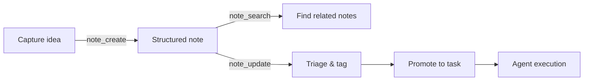

# Note-Driven Workflow

This tutorial shows how to use notio's MCP tools to create, search, and manage structured notes through an AI agent — the foundation for the worklog capture-to-task pipeline.

## The workflow

The note-driven workflow follows this progression:



This maps directly to worklog's object model: **Note** (captured thought) → **Task** (actionable work) → **Run** (agent execution).

## Prerequisites

- A projio workspace with notio initialized (`notio init --write-config`)
- MCP server configured (`projio mcp-config -C . --yes`)
- Agent permissions configured (`projio add claude` — see [Agent Safety & Permissions](../explanation/agent-safety.md))
- At least one note type configured in `notio.toml`

## Step 1: Check available note types

Ask the agent what types are configured:

````
You: What note types are available?
````

The agent calls `note_types()`:

```json
{
  "types": {
    "idea":    {"mode": "event", "template": "idea.md"},
    "issue":   {"mode": "event", "template": "issue.md"},
    "task":    {"mode": "event", "template": "task.md"},
    "meeting": {"mode": "event", "template": "meeting.md"},
    "daily":   {"mode": "period", "template": "daily.md"},
    "weekly":  {"mode": "period", "template": "weekly.md"}
  }
}
```

Note types have two modes:

- **event** — one note per occurrence (ideas, issues, tasks, meetings)
- **period** — one note per time window (daily logs, weekly summaries)

## Step 2: Capture an idea

````
You: Create an idea note titled "Batch processing for corpus updates"
````

The agent calls `note_create(note_type="idea", title="Batch processing for corpus updates")`:

```json
{
  "path": "docs/log/idea/idea-arash-20260318-143022.md",
  "type": "idea"
}
```

The created note has structured frontmatter:

```yaml
---
title: Batch processing for corpus updates
date: 2026-03-18
owner: arash
type: idea
status: open
tags: []
---
```

## Step 3: Create a task from an idea

When an idea is ready to become actionable:

````
You: Create a task note titled "Implement batch corpus update pipeline"
````

The agent calls `note_create(note_type="task", title="Implement batch corpus update pipeline")`:

```json
{
  "path": "docs/log/task/task-arash-20260318-143145.md",
  "type": "task"
}
```

## Step 4: Update note metadata

Triage notes by updating their frontmatter:

````
You: Update the task note at docs/log/task/task-arash-20260318-143145.md —
     set status to "in_progress" and add tags ["indexio", "pipeline"].
````

The agent calls `note_update(path="docs/log/task/task-arash-20260318-143145.md", fields='{"status": "in_progress", "tags": ["indexio", "pipeline"]}')`:

```json
{
  "path": "docs/log/task/task-arash-20260318-143145.md",
  "updated_fields": ["status", "tags"]
}
```

!!! info "Under the hood: `note_update`"

    The `fields` parameter is a JSON string. The tool parses it and merges key-value pairs into the note's YAML frontmatter. Existing fields not mentioned are preserved.

## Step 5: Search across notes

Find related notes using semantic search:

````
You: Search notes for "corpus indexing pipeline"
````

The agent calls `note_search(query="corpus indexing pipeline", k=5)`:

```json
{
  "results": [
    {"path": "docs/log/task/task-arash-20260318-143145.md", "score": 0.87, "title": "Implement batch corpus update pipeline"},
    {"path": "docs/log/idea/idea-arash-20260318-143022.md", "score": 0.82, "title": "Batch processing for corpus updates"},
    {"path": "docs/log/issue/issue-arash-20260315-091200.md", "score": 0.61, "title": "indexio sync fails on large corpora"}
  ]
}
```

## Step 6: List and review notes

List recent notes by type:

````
You: Show me the latest task notes.
````

The agent calls `note_list(note_type="task", limit=10)` to get recent tasks, then `note_read(path)` on any that need review.

## Agent triage pattern

A typical triage session combines multiple tools:

````
You: Review my open ideas and suggest which should become tasks.
````

The agent:

1. Calls `note_list(note_type="idea")` to get all ideas
2. Calls `note_read(path)` on each to read content
3. Calls `note_search` to check for related existing tasks
4. Recommends which ideas to promote
5. Calls `note_create(note_type="task", ...)` for approved promotions
6. Calls `note_update` on the original ideas to set `status: "promoted"`

This is the pattern that worklog automates: captured ideas flow through triage into the task queue, where they can trigger agent runs.

## Worklog integration

In the full pipeline, worklog orchestrates this flow:

1. **Capture** — voice/text via Telegram → worklog transcribes
2. **Materialize** — worklog calls `note_create` to create a notio note
3. **Triage** — worklog (or agent) calls `note_search` + `note_update` to categorize
4. **Promote** — worklog promotes notes to tasks via `note_create(note_type="task")`
5. **Execute** — tasks trigger scoped agent runs against project repos

The projio MCP tools provide the infrastructure; worklog provides the orchestration logic.

## CLI equivalents

Everything the agent does via MCP can also be done from the command line:

```bash
notio note idea --title "Batch processing for corpus updates"
notio note task --title "Implement batch corpus update pipeline"
notio toc --all    # rebuild index pages
```

The MCP tools add structured return values and searchability that CLI output lacks.

## Next steps

- [Semantic Search Pipeline](search-pipeline.md) — build a searchable corpus from your notes and documents
- [Agent Orchestration](agent-orchestration.md) — combine notes with bibliography, code intelligence, and search in a single agent session
