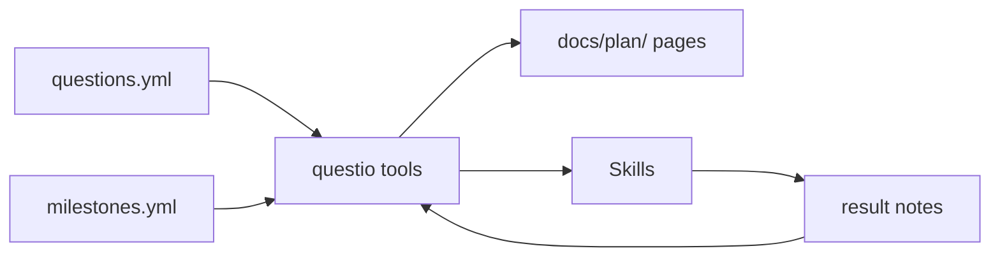

# Questio: Research Orchestration Setup

This tutorial walks through setting up questio in a project — from defining research questions to running your first agentic research session.

## What you'll build

By the end, your project will have:

- A machine-readable research plan (`plan/questions.yml`, `plan/milestones.yml`)
- A `result` note type for capturing structured evidence
- Auto-generated plan docs on your site (questions, milestones, roadmap, evidence index)
- Skills for agent-driven research sessions



## Prerequisites

- A projio workspace (`projio init .`)
- notio installed (included with projio)
- MCP server configured (`projio mcp-config -C . --yes`)
- A research project with hypotheses or research questions to track

## Step 1: Define your research questions

Create `plan/questions.yml` in your project root. Each question gets an ID, a text description, and links to pipelines, milestones, and manuscript sections.

```yaml
# plan/questions.yml
questions:
  H1:
    text: "Does treatment A improve outcome X?"
    type: hypothesis
    prediction: "Treatment A produces a significant improvement in outcome X"
    pipelines: [preprocessing, analysis_main]
    milestones: [preprocessing-validated, treatment-effect-quantified]
    manuscript_section: results/h1-treatment-effect
    status: not_started
    depends_on: []
    citations: ["@smith_2023", "@jones_2024"]

  H2:
    text: "Is the effect moderated by variable Y?"
    type: hypothesis
    prediction: "Variable Y moderates the treatment effect"
    pipelines: [analysis_main, moderation_analysis]
    milestones: [treatment-effect-quantified, moderation-tested]
    manuscript_section: results/h2-moderation
    status: not_started
    depends_on: [H1]
    citations: ["@doe_2022"]

  E1:
    text: "What is the distribution of variable Z across conditions?"
    type: exploratory
    prediction: ""
    pipelines: [descriptive_stats]
    milestones: [descriptive-complete]
    manuscript_section: results/e1-descriptive
    status: not_started
    depends_on: []
    citations: []
```

!!! tip "Question types"

    Use `hypothesis` for testable predictions, `exploratory` for open-ended
    investigations, and `descriptive` for characterization work. The type
    helps the agent judge how to assess evidence sufficiency.

### Field reference

| Field | Required | Description |
|-------|----------|-------------|
| `text` | yes | The research question as a question |
| `type` | yes | `hypothesis`, `exploratory`, or `descriptive` |
| `prediction` | for hypotheses | The testable prediction |
| `pipelines` | yes | List of pipeio flow names that generate evidence |
| `milestones` | yes | List of milestone IDs (defined in milestones.yml) |
| `manuscript_section` | no | Path to the manuscript section this question feeds |
| `status` | yes | `not_started`, `in_progress`, `blocked`, `sufficient`, `confirmed`, `refuted` |
| `depends_on` | no | List of other question IDs that must be answered first |
| `citations` | no | Citekeys for key literature supporting this question |

## Step 2: Define milestones

Create `plan/milestones.yml`. Milestones are the concrete checkpoints between "question asked" and "question answered." They form a dependency graph.

```yaml
# plan/milestones.yml
milestones:
  preprocessing-validated:
    description: "Preprocessing pipeline validated for all subjects"
    pipelines: [preprocessing]
    depends_on: []
    status: not_started
    evidence: []

  treatment-effect-quantified:
    description: "Treatment effect measured with statistical tests"
    pipelines: [analysis_main]
    depends_on: [preprocessing-validated]
    status: not_started
    evidence: []

  moderation-tested:
    description: "Moderation analysis complete for variable Y"
    pipelines: [moderation_analysis]
    depends_on: [treatment-effect-quantified]
    status: not_started
    evidence: []

  descriptive-complete:
    description: "Descriptive statistics computed across all conditions"
    pipelines: [descriptive_stats]
    depends_on: [preprocessing-validated]
    status: not_started
    evidence: []
```

Key design rules:

- **Milestones are shared** — multiple questions can reference the same milestone
- **Dependencies are between milestones**, not questions — `depends_on` lists other milestone IDs
- **Evidence is a list of note IDs** — filled in as result notes are created

## Step 3: Set up the result note type

The `result` note type should already be available if you're using a recent version of notio. Verify by creating a test note:

```bash
notio note result --title "Test result note"
```

This should create a file in `docs/log/result/` with structured frontmatter including `question`, `milestone`, `metric`, `value`, and `confidence` fields.

If the note type isn't recognized, ensure you have the latest notio installed (`pip install -e packages/notio`).

!!! tip "Result note directory"

    Create the directory and index if they don't exist:

    ```bash
    mkdir -p docs/log/result
    ```

    Then create `docs/log/result/index.md`:

    ```markdown
    # Results

    Evidence records for research questions and milestones.
    ```

## Step 4: Generate plan docs

With the YAML files in place, generate the docs site pages:

````
You: Generate the questio plan docs.

The agent calls questio_docs_collect():
````

```json
{
  "generated": [
    "docs/plan/index.md",
    "docs/plan/questions.md",
    "docs/plan/milestones.md",
    "docs/plan/roadmap.md",
    "docs/plan/evidence.md"
  ]
}
```

This creates five pages:

- **index.md** — overall progress (e.g., "0/4 milestones complete, 0/3 questions sufficient")
- **questions.md** — table of all questions with status and evidence counts
- **milestones.md** — milestone tracker grouped by question
- **roadmap.md** — mermaid dependency diagram with color-coded status
- **evidence.md** — per-question evidence dossier (empty until you record results)

Build the site to see them rendered:

```bash
mkdocs serve
```

## Step 5: Check research status

Ask the agent for a status overview:

````
You: What's the current research status?

The agent calls questio_status():
````

```json
{
  "questions": [
    {
      "id": "H1",
      "text": "Does treatment A improve outcome X?",
      "status": "not_started",
      "milestone_progress": "0/2 complete",
      "evidence_count": 0,
      "blockers": []
    },
    {
      "id": "H2",
      "text": "Is the effect moderated by variable Y?",
      "status": "not_started",
      "milestone_progress": "0/2 complete",
      "evidence_count": 0,
      "blockers": ["preprocessing-validated"]
    }
  ],
  "overall": {
    "total_questions": 3,
    "milestone_completion": "0%",
    "total_evidence": 0
  }
}
```

## Step 6: Identify evidence gaps

Ask about a specific question:

````
You: What's missing to answer H1?

The agent calls questio_gap(question_id="H1"):
````

```json
{
  "question": { "id": "H1", "text": "Does treatment A improve outcome X?" },
  "gaps": {
    "unmet_milestones": ["preprocessing-validated", "treatment-effect-quantified"],
    "blocked_milestones": ["treatment-effect-quantified"],
    "actionable_milestones": ["preprocessing-validated"],
    "missing_evidence": ["preprocessing-validated", "treatment-effect-quantified"]
  },
  "recommendation": "Start with preprocessing-validated — it's unblocked and required by 3 downstream milestones."
}
```

## Step 7: Run a research session

Use the `questio-session` skill for a full guided workflow:

````
You: Let's do a research session.
````

The agent follows the session structure:

1. **Orient** — calls `questio_status()`, summarizes state
2. **Plan** — calls `questio_gap()` for active questions, recommends highest-impact work, asks for your approval
3. **Ground** — before starting, checks literature (`paper_context`), finds existing code (`codio_discover`), searches prior notes (`rag_query`)
4. **Execute** — assists with notebooks and pipelines (this is where the actual research work happens)
5. **Record** — creates a structured `result` note with evidence linked to question and milestone
6. **Close** — summarizes what was accomplished, updates plan docs

!!! tip "Session checkpoints"

    The session skill pauses for your approval at the Plan and Ground phases.
    The agent proposes, you decide. This keeps the human in the loop for
    scientific judgment while automating the bookkeeping.

## Step 8: Record evidence

After producing results (manually or via a session), record structured evidence:

````
You: Record the preprocessing validation results.
````

The agent uses the `questio-record` skill to:

1. Create a `result` note with proper frontmatter:

```yaml
---
title: "Preprocessing validated — all subjects pass QC"
tags: [result]
series: preprocessing
question: [H1, H2, E1]
milestone: preprocessing-validated
metric: qc_pass_rate
value: "100% (15/15 subjects)"
confidence: validated
---
```

2. Update `plan/milestones.yml` to add the note to the evidence list
3. Regenerate plan docs via `questio_docs_collect()`

## What's next

With questio set up, you can:

- **Run research sessions** — use `questio-session` at the start of each work block
- **Track progress** — `questio_status()` shows where you stand at any time
- **Generate reports** — use the `questio-report` skill before supervisor meetings
- **Check manuscript readiness** — use `questio-ready` to see which sections have sufficient evidence
- **Keep docs current** — run `questio_docs_collect()` after recording results to update the site

## Related

- [Questio Explanation](../explanation/questio.md) — architecture, data model, workflow loops
- [Design Spec](../specs/research-orchestration/design.md) — full design with open questions
- [Note-Driven Workflow](note-workflow.md) — how notio notes work (questio builds on this)
- [Grand Routine](grand-routine.md) — the broader exploration-to-production research workflow
