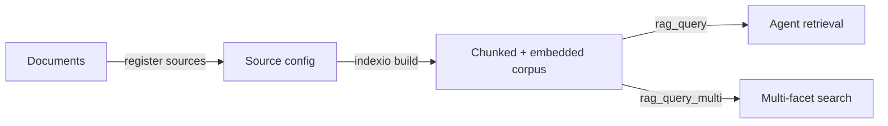

# Semantic Search Pipeline

This tutorial shows how to build a searchable corpus from your project's documents, then query it through MCP tools — giving agents grounded access to your project knowledge.

## The pipeline



## Prerequisites

- A projio workspace (`projio init .`)
- indexio installed (`pip install "projio[indexio]"`)
- Documents to index (markdown, PDFs, BibTeX, code)
- MCP server configured (`projio mcp-config -C . --yes`)

## Step 1: Initialize indexio

```bash
indexio init-config
```

This creates `infra/indexio/config.yml` with default settings for chunking and embedding.

## Step 2: Register sources

Tell indexio what to index. Sources are directories or file patterns:

```bash
indexio add-source docs/         # markdown documentation
indexio add-source bib/main.bib  # bibliography entries
indexio add-source src/          # source code
```

Each source gets chunking parameters appropriate to its content type. The config file (`infra/indexio/config.yml`) stores the registered sources.

!!! tip "What to index"

    Index the materials your agent needs for context:

    - **docs/** — project documentation, how-to guides, design decisions
    - **docs/log/** — notio notes (ideas, tasks, meeting notes)
    - **bib/** — bibliography entries and extracted paper text
    - **src/** — source code (useful for code search alongside codio)
    - **docs/reference/codelib/** — codio curated library notes

## Step 3: Build the corpus

```bash
indexio build
```

This runs the full pipeline:

1. **Scan** registered sources for files
2. **Chunk** documents into passages (respecting markdown headers, code blocks, etc.)
3. **Embed** chunks using the configured embedding model
4. **Store** the vector index for retrieval

Build time depends on corpus size. A typical research project (100 docs, 50 papers) takes a few minutes.

## Step 4: Query via MCP

### Single query

Ask the agent a question and it retrieves relevant passages:

````
You: What methods exist for detecting travelling waves in neural data?
````

The agent calls `rag_query(query="methods for detecting travelling waves in neural data", k=8)`:

```json
{
  "corpus": "default",
  "results": [
    {
      "chunk_id": "bib/docling/muller_2018.md:chunk_3",
      "score": 0.91,
      "text": "Phase gradient methods compute the spatial derivative of instantaneous phase...",
      "source": "bib/docling/muller_2018.md"
    },
    {
      "chunk_id": "docs/log/idea/idea-arash-20260310.md:chunk_1",
      "score": 0.84,
      "text": "Compare optical flow approaches vs phase gradient for wave detection...",
      "source": "docs/log/idea/idea-arash-20260310.md"
    }
  ]
}
```

The results include text excerpts with source attribution, so the agent can cite where information came from.

### Multi-query search

For complex questions that span multiple facets:

````
You: I need to understand both the mathematical foundations and the Python
     implementations for multitaper spectral analysis.
````

The agent calls `rag_query_multi`:

```json
{
  "queries": [
    "mathematical foundations of multitaper spectral analysis",
    "Python implementations of multitaper spectral estimation"
  ],
  "k": 5
}
```

Results are deduplicated across queries — a passage matching both facets appears once with the higher score.

### List corpora

````
You: What corpora are indexed?
````

The agent calls `corpus_list()`:

```json
{
  "corpora": [
    {"name": "default", "chunks": 1247, "sources": 5, "last_built": "2026-03-18T14:30:00"}
  ]
}
```

## Step 5: Keep the corpus current

After adding new documents, papers, or notes:

```bash
indexio build    # rebuilds incrementally
```

For biblio integration, register codio and biblio sources:

```bash
codio rag sync   # register codio sources in indexio
biblio rag sync  # register biblio sources in indexio
indexio build    # rebuild with new sources
```

## Agent patterns

### Grounded answers

The agent uses RAG to ground responses in your project's actual content rather than general knowledge:

````
You: Based on our project notes and papers, what's the recommended
     approach for phase estimation?
````

The agent calls `rag_query`, reads the top results, and synthesizes an answer citing specific documents.

### Cross-domain search

Combine RAG with other tools for comprehensive research:

````
You: Find everything we have about multitaper methods — papers,
     notes, and code libraries.
````

The agent:

1. Calls `rag_query("multitaper methods")` — finds papers and notes
2. Calls `codio_discover("multitaper spectral estimation")` — finds libraries
3. Calls `citekey_resolve` on any cited papers — gets full metadata
4. Synthesizes a comprehensive summary

### Worklog integration

In the worklog pipeline, semantic search supports:

- **Note triage** — find related notes before creating duplicates
- **Task context** — retrieve project knowledge relevant to a task before agent execution
- **Run reports** — ground agent summaries in actual project content

## Next steps

- [Agent Orchestration](agent-orchestration.md) — combine search with all ecosystem tools in a single session
- [Agent-Driven Ingestion](agent-ingestion.md) — ingest new papers and libraries to expand the corpus
